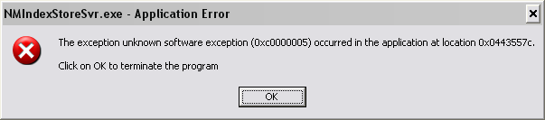

 It eats my CPU, it eats my memory, it eats my hard drive and
it evens likes to hang on the shut down of my computer.

It also quite fun playing 720p video content with this process running, as well
as any games!

Now it has just decided to crash on me... what fun!

So, I check the startup entries in Spybot, and search the registry, but the
stupid app is nowhere to be found in the startup entries, and yet its there
every time I turn my computer on!

So I use Process Explorer to track the bugger down. It turns out its part of...
Nero! Its description is "Nero Home". Strange, since I don't have Nero Home
installed. So in the end I renamed the file to some expletives, and now (gasp) I
can use my computer again ;-)
