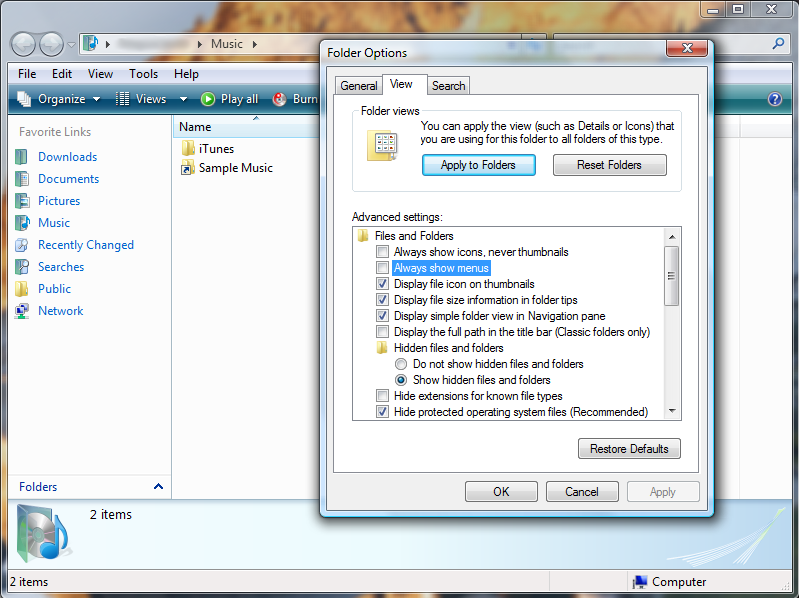

Normally, or at least by default, menus in Windows Explorer on Vista are hidden
until you press the ALT key on your keyboard. But for some reason my Vista
install displays menus permanently in all Windows Explorer windows. Despite the
fact I have the "Always show menus" option disabled:

 It's pretty annoying so I wouldn't mind knowing how to fix it..
