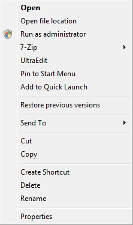

One of the changes in the Vista UX guidelines is regarding capitalisation. On
the subject, they say:

> Use title-style capitalization for titles, sentence-style capitalization for
> all other UI elements. Doing so is more appropriate for the Windows Vista tone
> and its more descriptive use of text.\
> Exception: For legacy applications, you may use title-style capitalization for
> command buttons, menus, and column headings if necessary to avoid mixing
> capitalization styles.

They also have a whole article
[dedicated to menus](http://msdn2.microsoft.com/en-us/library/aa511502.aspx#labels),
in which they say on labels:

> Use sentence-style capitalization.\
> Exception: For legacy applications, you may use title-style capitalization if
> necessary to avoid mixing capitalization styles.

One does wonder how much attention Microsoft pay to these guidelines. Let's take
a look at the context menu for a shortcut to a application in Windows Explorer
on Vista RTM + updates.

Ignoring the entries from 3rd party software, what do we find? Mixed
capitalisation styles. In sentence-style, we have "Run as administrator", "Open
file location" amongst others. In title-style we have "Pin to Start Menu",
"Create Shortcut" amongst others. It does looks somewhat unclean and why they
left it like this can only be described as a mystery.

In the same article about menu guidelines, we see some interesting differences
between what is shown there in the screenshots and what is actually in Vista:

 In this screenshot, WordPad in Vista is on the left, and from
the article is on the right. At least part of the UX guidelines were written
after Vista was released, so perhaps these changes should be looked out for in
Vista SP1.

It was also interesting to note in the same UX guidelines they point out some
errors in Vista RTM. For example this
[appears](http://msdn2.microsoft.com/en-us/library/aa511486.aspx#guidelines) in
the article on progress meters:

> **Incorrect:**
>
> \<image removed – it’s no longer available\>
>
> In this example, halting the copy leaves any copied files, so the command
> button should be labeled Stop.

If you've tried to cancel a file-copy operation in Vista, you'd realise this is
talking about the actual behaviour in Vista.
