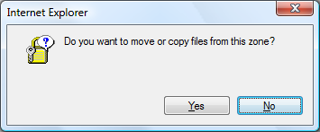

I do like making a note of strange dialogs for some reason. Here is one I got
trying to copy a file in Windows Explorer:

So what does _Internet Explorer_ have to do with copying a file? The source and
the destination were both on my local computer. Actually, the source file was
inside a Zip archive I downloaded, not using _Internet Explorer_ though.

Oh, and that icon looks a bit dated too.
