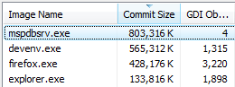

---
title:
  "This is what happens when you stick to hibernate instead of shut down..."
slug: this-is-what-happens-when-you-stick-to-hibernate-instead-of-shut-down
date: 2008-12-19T21:01:00.000Z
is_auto_excerpt: true
is_imported: true
comment_id: ghost-321
excerpt: |-
  ...and keep Visual Studio and Firefox permanently open:

  [http://1.bp.blogspot.com/_LAX0f7iuMtU/SUwMx7W_ObI/AAAAAAAAAEQ/F3xalk4NP3c/s1600-h/toolongcropped.png]
  First entry is biggest WTF. It is a part of Visual Studio. What it is doing with
  785MB committed memory (~45MB private working set (!) ) is a mystery (well, the
  problem is probably that it is doing nothing with it..). That is Visual Studio
  2008 SP1 also. Maybe if Microsoft included this column by default in Task
  Manager some application d
---

...and keep Visual Studio and Firefox permanently open:

First entry is biggest WTF. It is a part of Visual Studio. What it is doing with
785MB committed memory (\~45MB private working set (!) ) is a mystery (well, the
problem is probably that it is doing nothing with it..). That is Visual Studio
2008 SP1 also. Maybe if Microsoft included this column by default in Task
Manager some application developers may pay more attention to it.. (!)

I had a lot of tabs open in Firefox, but nevertheless it does seem to feed on
GDI objects. System-wide there was about 8.7k GDI objects in use... which is the
kind of point where I seem to face rendering glitches. Such as black screens in
place of UAC prompts. It gets pretty annoying. (Not entirely sure if this is
related to GDI resource usage actually.. possibly not.)

The other process using over 1k GDI resources in sidebar.exe. Must be a leak
since it doesn't do anything particularly different after some weeks than
shortly after boot-up (where it is using about 94). I will axe the only 3rd
party gadget loaded and see if that makes any difference..
