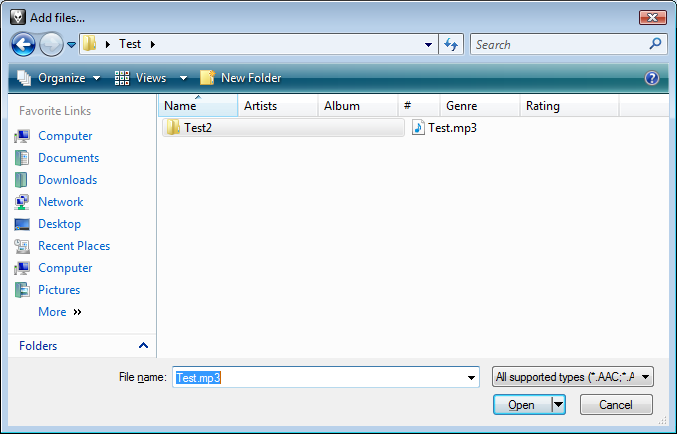

Oh, they definitely fixed some problems, but they also didn't fix some (and
possibly added some).

1. I think this one is new because I never noticed it before. Open an explorer
   window and start renaming a file. Change the extension and then left click in
   some empty space in the explorer window. The "Confirm file extension change"
   change prompt comes up, left click on Yes. Now very annoyingly a selection
   box appears.

2. If you open an explorer window, select a file, and then minimise and restore
   the window the keyboard focus is lost and set to nothing useful (you can
   visibly see the selected items having the inactive colour). This means you
   can't use the mouse wheel, left/right keyboard keys, CTRL-C etc. until you
   click on the item list again. I have no idea how such an obvious bug remained
   in RTM and even in SP1 - it completely broke my work patterns using CTRl-C
   and CTRL-V. For more weirdness, after doing this you can press the
   application/context menu key to see a context menu pop up in a random place.

3. On my desktop with Vista x64 I still see the problem where randomly (although
   very rarely) some icons in the Control Panel display as blank, useless icons.
   Reopening the window sometimes fixes it.

4. There's still some issues with the synchronisation of the "File name" field
   in the "File Open" dialog. In this screenshot, what will happen if you click
   on Open?

   In this instance (the events beforehand matter), it
   wouldn't open Test.mp3 specified in the "File name" field but rather the
   Test2 folder.

5. Oh, this isn't my complete list, just the first ones that popped into my
   head.

Also, not technically a bug, but it's extremely annoying how the Safely Remove
hardware command refuses to safely remove a portable disk drive (specifically:
an iPod) when any Windows Explorer windows have a folder in the drive displayed.
XP used to close those automatically (I mean, I did say I wanted to disconnect
the device after all..?)
