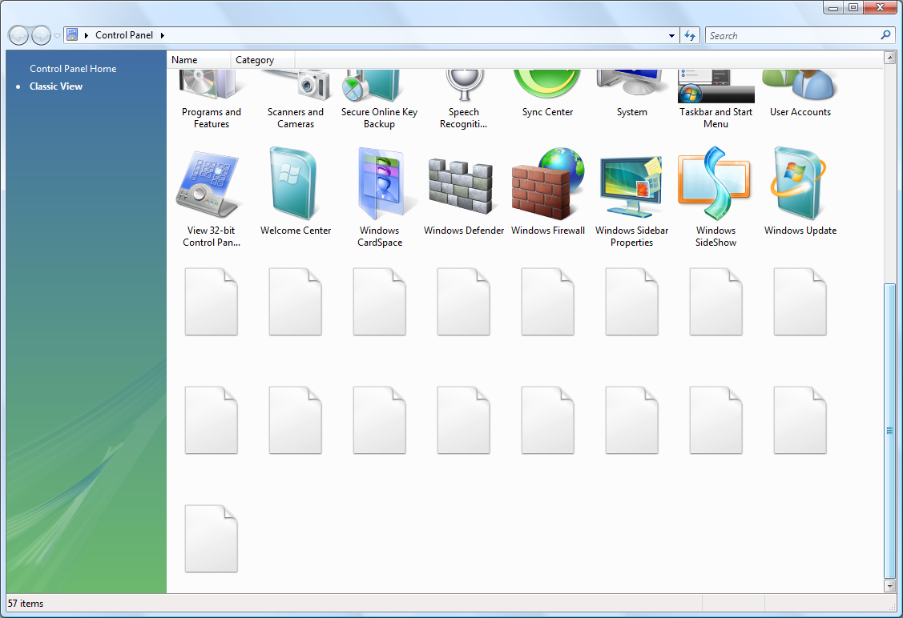

I just opened up the Control Panel on my Vista x64 machine and just felt very
annoyed. Why? Because it looked like this:

What's wrong here?

1. Half of the applets did not load correctly... I have complained about this
   before but it doesn't hurt to complain again. A refresh sorts this out. It
   may be some kind of time-out loading applets.
2. For some reason Vista has arbitrarily decided to change the current view to
   large icons. It likes arbitrarily changing the views of folders you see. This
   is incredibly annoying.

I saw
[this](http://www.askvg.com/sp1-failed-to-fix-several-windows-vista-bugs-do-we-need-sp2/)
the other day. I didn't read all of it, but just by looking at some of the
pictures it looks like much of the stuff I've noticed. Let's hope things are
better if not in SP2, then Windows 7....

PS: Another annoyance is when you try to execute a large downloaded file (or
something like that, there may be other factors involved). Nothing happens for
several minutes whilst it verifies a digital signature or whatever. You'd think
they'd know better and show some kind of progress dialog. Even worse, it can
leave you wondering if the double click registered so you may double click
again. Now try doing that over a network..
