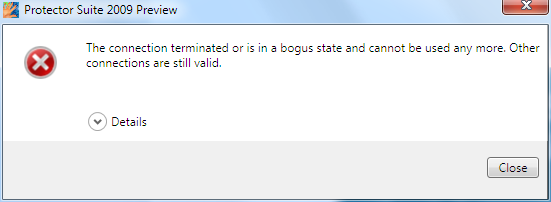
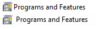

I gave in and upgraded Windows Vista SP2 on my laptop to Windows 7 RC.
(Moreover, I plan to buy a new laptop around when RTM is released anyway, so I
hopefully don't need to worry so much about the update from RC to RTM).

Some observations I made:

## Installation/Upgrade from Vista

- It asked me to uninstall PerfectDisk (2008) before it would let me continue.
  Fine I did so. But it still persisted to ask me to uninstall it **after it was
  uninstalled**. I had to have a look in the Windows 7 setup log to find out
  what it was picking up. PerfeckDisk is one of those applications that likes to
  copy its setup files to a separate folder within the Program Files folder.
  Apparently Windows 7 was checking every binary in the Program Files folder (or
  something), and so was picking those up.. Hence, removing those setup files
  overcame this. (There was some other strange things about some of the apps
  that were detected, but the other ones didn't block the installation at
  least).
- The upgrade took a fair while - about 3.5 hours. It spent a lot of time
  gathering and then restoring system/user files, settings and programs. I won't
  question it...
- After upgrading, Kaspersky decided to forget its "activation code" (i.e.
  licence key). Whoever the fault lies with, uninstalling it was easier than
  bothering to find the licence key.

## Windows Explorer

- Where are the sort header buttons in Windows Explorer gone that were in Vista
  (in views other than details)?
  [It doesn't seem](http://social.technet.microsoft.com/Forums/en-US/w7itproui/thread/eaed7f8b-9011-41ae-97cf-23135a045888)
  [that I'm alone](http://social.technet.microsoft.com/Forums/en-US/w7itproui/thread/8f11de8a-6c5c-41d3-9bfc-367641b5d2b1)
  in missing them!
- The status bar doesn't display file sizes anymore, as it is apparently
  superseded by the details pane. Yet the details pane is slow to update, and
  doesn't display file sizes when you have more than 15 files selected - a bit
  of a nuisance.
- They seem to have a new list control here, unfortunately it has does have some
  strange quirks.

## Biometric Support

Initially it seemed pretty nice, as that when combined with the new UPEK
Protector Suite software, fingerprint recognition at the logon screen when the
computer was locked was really quick compared to with the old software on
Vista/XP. But, it mostly has stopped working after having my laptop on for a few
days (generally, I use standby and hibernate rather than shutdown). Most of the
problems are probably down to the UPEK software, though. Anyway now that my
laptop has not been restarted for several days we have:

- Doesn't recognise fingerprint swipes for most of the sessions after coming out
  of standby. Maybe related to this message in the event log: "S1: Fingerprint
  sensor device communication error."
- Windows Biometric Support service crashing on the occasion in some UPEK
  library
- The issue in the below post with the UPEK software leaking things at stupid
  rates
- This WTF message from the UPEK software (followed by it not working):

On reflection, the problem here seems to be general suckage of the UPEK
software.

**Update:** Amusingly, UPEK have apparently found me judging by the comment left
on this post :p

## "Superbar"

It has its positives and negatives:

- What is really nice is the space it gives. I generally have lots of things
  running so I do appreciate this.
- But when you have multiple windows of an application open, it can be quite
  hard to navigate, especially with a touchpad. I may have five explorer windows
  open - if the Explorer icon is in the bottom left of the screen the thumbnails
  will be weighted to the right of the icon. Then to copy and paste a file from
  fifth window to the fourth with the touchpad, it involves a lot of work. In
  this respect, it would be easier if the thumbnails were stacked vertically, as
  you could move the mouse in a straight vertical motion. Or perhaps if the
  Alt-Tab menu had labels underneath each thumbnail.
- I did also think one of the reasons of web browser tabs was to reduce taskbar
  clutter - showing them as separate 'sub-windows' seems to negate that somewhat
  to me. I often keep 20+ tabs open in Firefox, so it seems this would quickly
  fall apart. It also breaks the simple act of clicking on the taskbar icon to
  do a simple minimise/restore. Though, I appreciate that sometimes it is quite
  useful.
- Why can't the jump list appear next to the mouse when you right click instead
  of above the taskbar? Again more unnecessary mouse movements. The jump list
  also makes doing something like 'Open file location' a chore (compared to the
  old quick launch) as the command does not appear when you right click on the
  application entry in the jump list (you have to go through properties).
- Also, the position of 'Show desktop' seems a failure to me. I often blindly
  click there when I instead wanted to show the calendar. And when I want to
  show the desktop, I find myself near the start button - it seems like a better
  location also because icons on the desktop are usually located on the left.
- I do feel that a medium option for the size of the taskbar icons would have
  been nice, alongside the existing small and large options.
- Why is the text used in Jump Lists weirdly blurry? Comparison below (top is
  main pane of start menu, bottom control panel jump list). It does depend on
  the angle I look at my laptop display, actually. If you zoom in closely, the
  reason it might look quite different is obvious.

  

That's enough for now...
