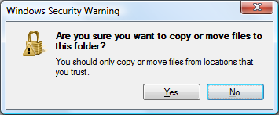

Probably not to me though.

The 'Internet Explorer' Windows Explorer warning I complained about some posts
below now looks like this in Vista SP2:

Not only did they remove the Intenet Explorer references and make it make sense,
they also changed the icon I complained about :P
