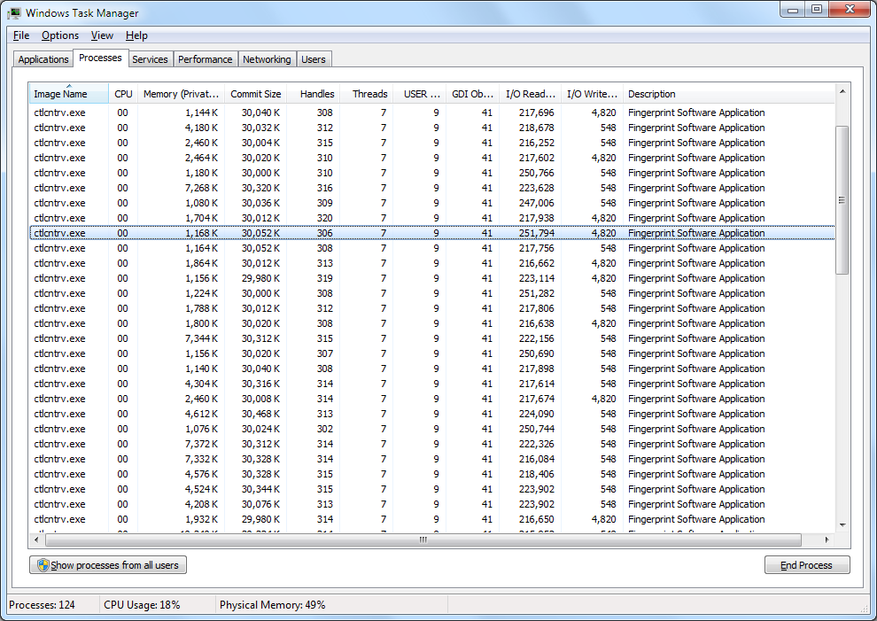

I thought (or perhaps naively hoped) UPEK had fixed all their issues. Alas, I
was to be disappointed on a large scale as you can see below.

I admit, it's not a regular occurrence, but once is more than enough..

I'll try Authentec next time..
