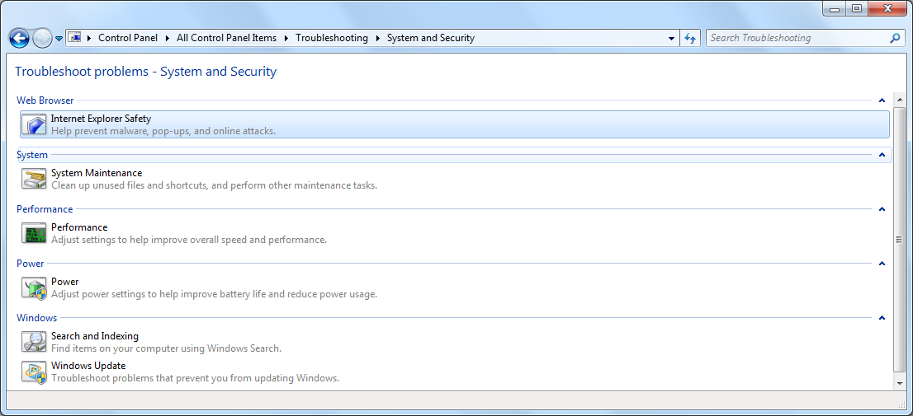

I decided to go ahead and buy a TechNet subscription so I could "evaluate"
Windows 7, and am now running Windows 7 RTM on both of my computers. One was an
upgrade from Windows Vista 64-bit, the other was a (sneaky) forced upgrade from
Windows 7 RC.

In the spirit of "evaluating" Windows 7, I thought I might post some of the
issues/problems I have encountered in the RTM version:

- The upgrade process reset the date modified attribute for all the directories
  in my user folder. That was one of my favourite things to sort by, so
  definitely an annoyance.
- The installer asked me to remove Avira AntiVirus which wasn't actually
  installed anymore. It was in fact complaining about some old left over driver
  which I had to manually remove - but how they expect the average user to work
  that out I don't know.
- I had a printer shared on the Windows Vista installation. I had renamed the
  share (to change a space to an underscore, because I was trying to make it
  accessible from another Mac OS X computer). After upgrading from Vista to 7,
  the share was still there but it didn't actually work anymore. In Devices and
  Printers, the printer wasn't marked as shared so I had to share it again.
  Unsurprisingly, I couldn't use the old share name. I am now left with two
  printer shares, one of which doesn't work. I thought I would try and remove
  the dead share using the "net share" CLI command, but I just get: "System
  error 1801 has occurred. The printer name is invalid." Lovely.
- This one was on the machine I did the naughty upgrade from Win 7 RC on, but I
  can't say if that was related to the problem or not. I had .NET Framework 4
  beta 1 installed on Win 7 RC, after upgrading to Win 7 RTM I ended up with a
  broken .NET Framework installation. The solution here was to uninstall .NET
  Framework 4 and then reinstall it.
- When dragging an object from an external application (say foobar2000) Windows
  Explorer windows no longer automatically scrolls when you are near the edges
  of the items area.
- When dragging an item over an empty area of the task bar, it no longer shows
  the desktop automatically. This is probably due to the fact that you can now
  pin items to the task bar - my view though is that it could very well do both.
  You can now go over to the show desktop button, but that is all the way in the
  bottom right corner..
- [This](http://www.neowin.net/forum/index.php?showtopic=817242) is definitely
  annoying, it happens on my desktop with a WUXGA monitor. Since it is reported
  on both AMD ATI and nVidia graphics cards, I'm reluctant to blame the graphics
  card driver (which is the latest version).
- When connecting say an SD Card, it doesn't prompt you to view the files or do
  something with it. I think they have changed this in Vista now also. There is
  probably some way to change this, I will have to have a look, but generally I
  want to look at the photos or something when I put in the card from my
  camera..
- I wrote about it before, but the removal of the columns header in the Windows
  Explorer views other than Details is a major step backwards. You now can't at
  a glance see the current sort order. Sorting by the reverse order of another
  criteria now takes a lot more work.
- I wrote about this before, but I still think the Show Desktop icon should be
  near the bottom left of the screen. The desktop icons are usually on the left
  of the screen, and also I ~~like~~ liked to blindly click in the bottom right
  to view the calendar.
- Amazingly, the Windows Photo Viewer doesn't handle smooth (Microsoft) mouse
  wheels correctly. It falls into the category "doesn't react unless you scroll
  the wheel exceptionally fast", and the bug I believe is a is a carry over from
  Windows Vista.
  [My post on WM_MOUSEWHEEL failings](/2009/02/07/why-do-people-fail-at-handling-wm-mousewheel-properly/)
  is currently the fourth result on Google.com for "WM_MOUSEWHEEL", so hopefully
  I've made the world a better place regardless :p
- Some of the changes to Windows Update seem a step backwards to me. On the page
  where you select which updates to install, the published date column has been
  removed, so you have to click on each individual update to see the date. There
  is also now no "Install" button on that page, you are returned to the previous
  page to click on install which is a bit more mouse work.
- Somehow this UI glitch wasn't spotted: 

  Yes it is minor enough (the "System" text overlaps the mouse over background),
  but surely you would notice that from the get-go?

- The new calculator also tends to slow me down. Vista essentially has the
  "Scientific" and "Programmer" combined in one, and as I use both views all the
  time this was really useful. They are separated in Windows 7 which means
  constant switching of the view, which also causes you to lose your current
  number (it did before, but I never needed to change view). If they had a
  toolbar with buttons to change the view, that might help. Animations that
  weren't quite as annoying after the tenth time would also help. As I mentioned
  previously, the swapping of the View and Edit menus is also a nuisance. (Some
  of the new parts of the calculator are useful though, for example the binary
  display in Programmer view).
- It really seems unnecessary/mean to remove the Vista Ultimate Extra games
  (Hold 'Em etc.) when upgrading to Windows 7. It should provide compatible
  versions.
- **The best is saved until last:** On the Windows Update restart reminder, the
  "Remind me in" time defaults to 10 minutes. If you click on the drop down
  (mouse left click), press down a few times to four hours (keyboard down
  arrow), click on the drop down again (mouse left click) and then click on
  Postpone (mouse left click) it will prompt you again in 10 minutes - _not_
  four hours. Not the first time mixed keyboard and mouse navigation has caused
  issues. This was probably an issue in Windows Vista too but I only recently
  worked it out. At least I now know why that prompt annoyed me to no end!

OK, I think I got most of it out of my system :p
