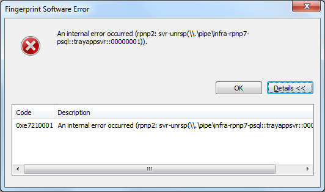

As I know the nice person(s) at UPEK like to take notice of things posted here,
I thought I'd write about a couple of new problems I had with Protector Suite /
my fingerprint reader under Windows 7.

1. A new error message appeared today; it was hiding under all other windows so
   it went unnoticed for a while:

   

   First time I've seen that one, so not an often occurrence.

2. Sometimes after resuming from sleep, my fingerprint reader doesn't function
   (no feedback when swiping). If I try to restart the Windows Biometric
   Service, it times-out or something, though after a while things work again.

   Perhaps the below message logged by Windows will help. There's also something
   for the Windows Biometric Service from when I tried to restart it, that's
   under Bucket ID 1376951512.

   ```
   Source
   Windows Driver Foundation - User-mode Driver Framework Host Process

   Summary
   Driver host process timeout.

   Date
   ‎02/‎02/‎2010 8:40 AM

   Status
   Report sent

   Description
   The Windows User-Mode Driver Framework detected that a driver host-process did not complete a critical operation within the allowed timeout period.
   This report contains information about the process and the drivers running within and will be used to improve the quality of these drivers.

   Problem signature
   Problem Event Name: WUDFHostProblem
   EventClass: HostProblem
   Problem: HostTimeout
   DetectedBy: 2
   UMDFVersion: 6.1.7600.16385. (win7_rtm.090713-1255)
   ExitCode: 103
   Operation: 0
   Message: 6
   Status: ffffffff
   HardwareId: USB\VID_147E&PID_2016&REV_0001
   OS Version: 6.1.7600.2.0.0.256.1
   Locale ID: 2057

   Extra information about the problem
   Bucket ID: 4
   ```

   That's with driver version 1.3.0.214, the latest version available for
   download at time of writing.
