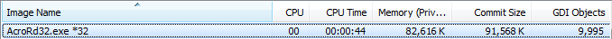

Hi Adobe,

You might want to do a better job testing your software before releasing it.

I was happily reading a PDF document when I wondered why the taskbar clock was
where the start button should be. Also, Adobe Reader had rendering glitches
everywhere. Recognising the symptoms, I fired up task manager:

Yes - Adobe Reader X 10.0.1 has a large GDI-resource leak bug. **This happens
when the semi-transparent light blue search box overlay is visible.** If you are
in select mode, a chunk of resources will be leaked every time the text cursor
flashes. Otherwise, just scrolling around will leak a chunk of resources.
Eventually you will reach the default 10k limit. Lovely. Eventually my taskbar
responding.
