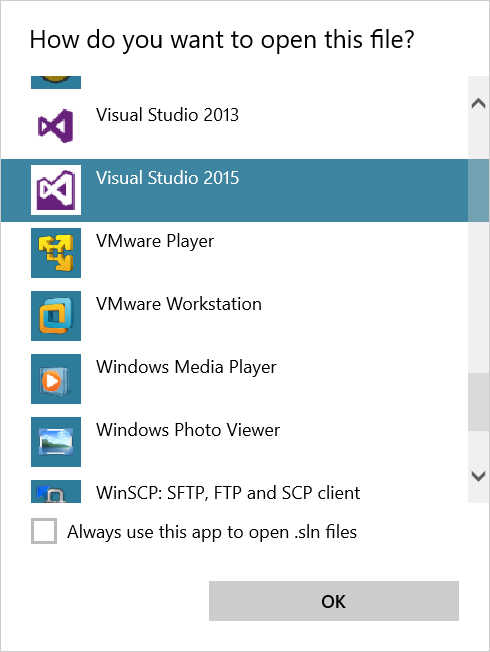
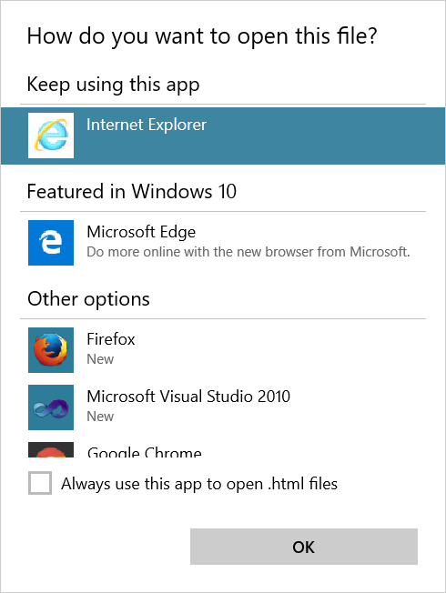

It certainly feels like all the feedback I enter into the Windows Feedback app
on Windows 10 ends up in free fall towards the floor of a bottomless abyss. So,
perhaps inscribing my thoughts on the more traditional world wide web will be a
more productive use of time.

My first in a series of complaints is the 'How do you want to open this file?'
dialog box:

My initial complaint (which I'll come back to) was simply that it does not
mention which file it is talking about. On closer inspection, though, there are
other things amiss. Firstly, albeit a minor quibble, the title seems a bit silly
to me – if someone asked me that question I would probably reply 'quickly'. Not
sure what is wrong with 'Which app do you want to open this file with?' (apart
from being slightly longer).

Secondly, if you view the images at their original sizes, you'll notice the
icons are distorted. I use 125% DPI on this PC which is presumably something to
do with it.

Back to the original complaint. It can be summarised as: I was running a script
in the background. The script sometimes runs a Python script. Some time after I
started the script, one of these dialog boxes popped up and I had no idea what
file it was referring to. It annoyed me that it did not tell me.

Now I've started writing, I've realised I have even more complaints with this
dialog box. Why does it close when you click somewhere else? There is zero
visual indication it is going to do that. And, why is there no cancel button?

On my laptop, if I try to open a JPEG I get this:

[.png>)](<./2015-12-29+(1).png>)

I haven't as yet selected "%1" to see what happens.

And here's another one. If you try to change the program associated with a file
extension via Control Panel, you get this version of the dialog box:

[.png>)](<./2015-12-29+(2).png>)

The title makes no sense. There is no 'this .py file'!
