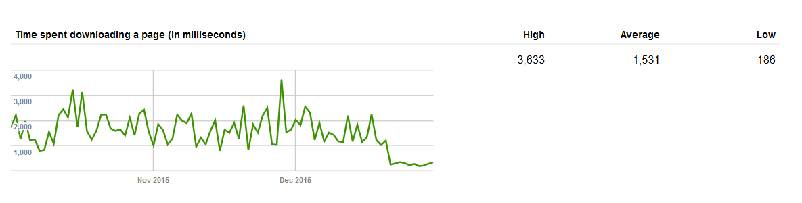

I shifted yuo.be to Amazon Web Services. Here's a recent screenshot of the 'Time
spent downloading a page' graph from the Googlebot crawler stats displayed in
the [Google Search Console](https://www.google.com/intl/en/webmasters/):

Can you pinpoint when the switchover happened? _Yes, my old host was that bad._

The baseline 'Pages crawled per day' has also increased – presumably it was
throttling itself before...
