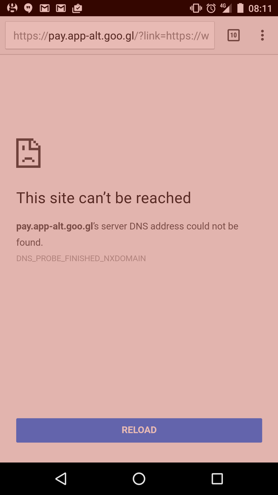

Google are currently running an Android Pay promotion in the UK for the festive
season. Every time you use Android Pay this month (December 2016), you
[get a chance of winning a prize](https://www.android.com/intl/en_uk/pay/promotions/shoptapreward/)
\[[archive](http://archive.is/P3L0I)]. The first five times, you also get a
coin. And five coins gives you a £3 Costa gift card.

This morning, I collected my fifth coin, and was informed I could claim a £3
Costa gift card. But, in order to do so, you must tap a button which opens a
link. The link went to a URL in the form:

```
https://pay.app-alt.goo.gl/?link=https://www.android.com/payapp/savetoandroidpay/<a-very-long-json-web-token>?omitSnackbar=true&apn=com.google.android.apps.walletnfcrel
```

As an aside, the URL contained a long string which I recognised as a
Base64-encoded
[JSON web token (JWT)](https://en.wikipedia.org/wiki/JSON_Web_Token), and
[knew could easily be decoded](https://jwt.io/). The decoded payload looked like
this (numbers replaced with `xxx`):

```json
{
  "aud": "google",
  "iat": xxx,
  "iss": "elliots-test-wobs-account@appspot.gserviceaccount.com",
  "typ": "savetowallet",
  "payload": {
    "loyaltyObjects": [],
    "offerObjects": [],
    "giftCardObjects": [
      {
        "barcode": {
          "alternateText": "xxx",
          "type": "qrcode",
          "value": "xxx"
        },
        "cardNumber": "xxx",
        "classId": "xxx.CostaCoffee_GC_UK_Campaign",
        "id": "xxx.xxx",
        "kind": "walletobjects#giftCardObject",
        "state": "active",
        "version": "1"
      }
    ]
  },
  "origins": [
    "https://google.com"
  ]
}
```

(JWTs work because they are cryptographically signed, in this case using RS256.)

Returning to the main story, Android Pay tried to open the URL in Chrome, which
greeted me with the following:



The DNS lookup for `pay.app-alt.goo.gl` failed, and still does at present. This
can be confirmed using `nslookup`, and it even fails when using the Google
public DNS servers (so it wasn't related to the DNS server used initially):

```
X:\> nslookup pay.app-alt.goo.gl 8.8.8.8
Server:  google-public-dns-a.google.com
Address:  8.8.8.8

*** google-public-dns-a.google.com can't find pay.app-alt.goo.gl: Non-existent domain
```

It looked like my £3 gift card was on the verge of a descent into a deep abyss,
but I had observed that the URL ended with another URL. I stripped off the
`https://pay.app-alt.goo.gl/?link=` part of the URL[^1], opening the remaining
part starting with `https://www.android.com`, and to my relief a page inviting
me to claim my £3 gift card appeared. In other words, `pay.app-alt.goo.gl` was
just some kind of redirect server which wasn't even needed.

An absurd situation, which many would struggle to get themselves out of by
themselves. Peculiarly, I didn't find any other references to the problem from
some quick searches online, so whether I'm the only one to encounter this
problem I don't know.

Perhaps Elliot[^2] has the answer? If you know how to contact him, feel free to
send him a link to this post. (And let him know that I wish him a very happy
Wobs.)

[^1]:
    The URL was 1287 characters long, and tapping on it in the address bar in
    Chrome took me to the end of it, so scrolling to the beginning of it was
    quite a chore.

[^2]:
    The Elliot from *elliots-test-wobs-account@appspot.gserviceaccount.com* in
    the JWT payload.
