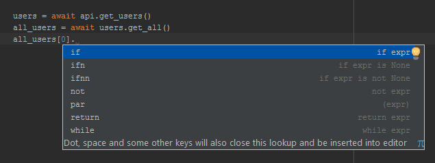
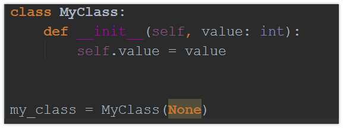
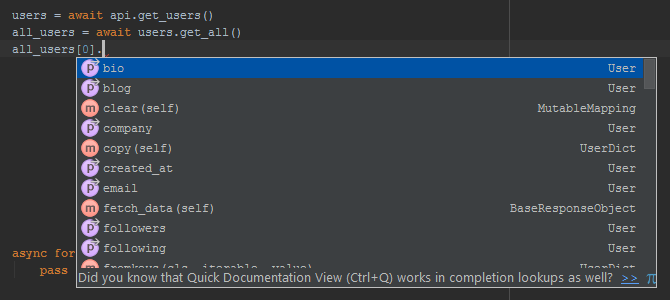
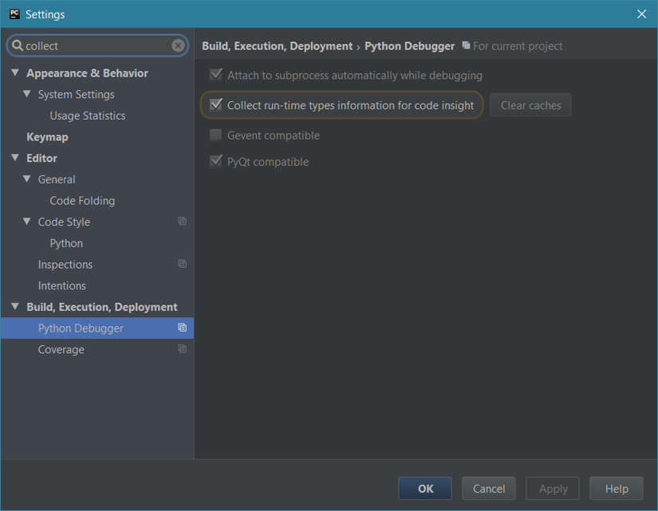
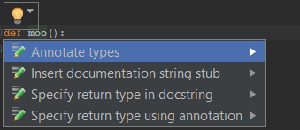

If you've written Python code using an IDE, you might have found that the IDE
does a reasonable job at inferring types of function arguments and return
values. But, you may have also run into instances when the IDE failed to deduce
the type of an argument or of a value returned by a function.

One implication of the IDE not knowing the type of an object is that it stops
code completion suggesting anything particularly useful. For example, here,
PyCharm doesn't know the type of the elements of the `all_users` list:



That's a slightly more complex example, but I was curious: could type hints in
Python 3.5 tell PyCharm what type the elements of my `all_users` list have?

## Back up. What are type hints?

Here's a simple example of type hints in Python 3.5:

```python
def hello_there(name: str) -> str:
    return 'Hello ' + name
```

Here, the type hints indicate that the `name` parameter of the `hello_there()`
function is a string, and that the function returns a string.

I picked the word indicate carefully: type hints aren't checked at run-time in
CPython (at least by default); the main purpose of them is for static analysis
(but that does not preclude other uses of them).

They are also optional – you can use them as much, or as little, as you want.
For versions of Python older than 3.5, other options exist using either comments
or docstrings, but these aren't covered here as the specific method you need to
use may depend on the tool you are using.

## Dealing with None

You might inadvertently run into situations like this when you start using type
hints.



The first thing that's interesting here is that PyCharm has highlighted `None`
being used to initialise an instance of `MyClass` as a problem. Once you start
using type hints, PyCharm will highlight type mismatches like this.

But why is it a type mismatch? Simply because `None` has a different type from
`int`. Type `type(None)` in a Python console, and you'll get something with a
name of `NoneType` back.

So how do you deal with situations like this? Enter the
[typing standard library module](https://docs.python.org/3/library/typing.html#module-typing).
In there, we have two relevant things: `Union` and `Optional`.

`Union` is used to indicate a type could be one of multiple types:

```python
def print_plus_one(value: Union[int, float]) -> None:
    print(value + 1)
```

So, in the earlier example, we could've used `Union[None, int]` to indicate that
`None` was an acceptable argument to `MyClass`'s `__init__()` method. However,
`Optional[TypeA, TypeB, TypeC]` is equivalent to
`Union[None, TypeA, TypeB, TypeC]`, so it's likely to be `Optional` you'd want
to use in cases like this. Note also that `None` was used to indicate that the
function does not return anything.

The observant among you may be wondering if using `None` like this is correct,
as we observed earlier that the type of `None` is something else. In fact,
`type(None)` and `None` are interchangeable in type hints, so you may prefer to
use `None` (as I do).

**Update 23 August 2016**

It's worth noting that you don't need to use `Optional` for parameters with a
default value of `None` as it is automatically inferred (though you can use it
if you wish).

## Type aliases

If you're using a complex type definition multiple times, you can define a type
alias using variable assignment:

```python
from typing import Union

T = Union[int, float, complex]

def print_plus_one(value: T) -> None:
    print(value + 1)
```

## Collections and more

Other useful goodies in the `typing` module include collection types, such as
`Tuple`, `Sequence`, `List`, `Mapping`, `Dict` and `Iterable`.

Using them is simple. To define a tuple type where the first element is an `int`
and the second a `str`, just use `Tuple[int, str]`. For a `list` of strings, use
`List[str]`.

Note that it is usually preferable to use `Sequence` or `MutableSequence` as the
type of a function parameter (rather than `List`), as typically you are
concerned about whether it behaves like a list rather than whether it actually
is a list. (Specifically, `Sequence`s and `MutableSequence`s are expected to
implement
[the methods defined in the corresponding abstract base classes](https://docs.python.org/3/library/collections.abc.html#collections-abstract-base-classes).)

Another useful type in the `typing` module is `Any` (representing any type, for
example when a function can take an argument of any type).

## Generics

Most of the collection types referred to above are examples of generics. A
generic type is one where types used in its methods have been parameterised. For
example, the `append()` method of a `List[int]` takes an argument of type `int`,
and `pop()` similarly also returns an `int`.

You can extend predefined generic types, such as `List` and `Iterable`, by
deriving from them, and defining a type variable (used in a parameter-like way):

```python
>>> from typing import TypeVar, List
>>>
>>> T = TypeVar('T')
>>>
>>> class MyList(List[T]):
...     def first(self) -> T:
...         return self[0]
...
>>> numbers = MyList(range(5, 10))
>>> print(isinstance(numbers, list))
True
>>> print(numbers.first())
5
```

You can also define completely new generic types:

```python
from typing import TypeVar, Generic

T = TypeVar('T')

class Object(Generic[T]):
    def __init__(self, value: T) -> None:
        self.value = value

    def get(self) -> T:
        return self.value

def create_object(value: T) -> Object[T]:
    return Object(value)
```

`create_object()` is an example of a generic function. The type of its return
value depends on the type of its argument.

Note that deriving from a predefined generic type isn't necessarily the same as
deriving from the corresponding abstract base class.

The
[documentation for `typing.Iterable`](https://docs.python.org/3/library/typing.html#typing.Iterable)
says:

> class typing.Iterable(Generic\[T_co])
>
> &nbsp;&nbsp;&nbsp;&nbsp;A generic version of the collections.abc.Iterable.

That may make you think that deriving from it is the same as deriving from the
abstract base class, but it's easy to see that it's not:

```python
>>> import typing
>>> from collections import abc
>>>
>>> T = typing.TypeVar('T')
>>>
>>>
>>> class MyIterableTyping(typing.Iterable[T]):
...     pass
...
>>>
>>> class MyIterableAbc(abc.Iterable):
...     pass
...
>>>
>>> MyIterableTyping()
<__main__.MyIterableTyping object at 0x000001EAC9E98320>
>>>
>>> MyIterableAbc()
Traceback (most recent call last):
  File "<stdin>", line 1, in <module>
TypeError: Can't instantiate abstract class MyIterableAbc with abstract methods __iter__
```

Despite `__iter__()` not being implemented, we were allowed to instantiate
`MyIterableTyping`. As you can see, that wasn't the case for `MyIterableAbc`,
where instantiation caused an exception to be raised. You _can_ derive from both
`typing.Iterable` and `collections.abc.Iterable`, though, should you wish to.

**Update 26 March 2017** This appears to have been fixed as of Python 3.5.3 and
3.6.0, so there's no longer a need to additionally inherit from
`collections.abc.Iterable`.

## Getting type hints programmatically

If you have a need to, `typing.get_type_hints()` can be used to programmatically
inspect type hints:

```python
>>> from typing import get_type_hints
>>>
>>> def hello_there(name: str) -> str:
...     return 'Hello ' + name
...
>>> get_type_hints(hello_there)
{'return': <class 'str'>, 'name': <class 'str'>}
```

## Forward referencing types

Sometimes, you'll need to reference types that are yet to be defined. A simple
example is a class that references its own type. You can simply put the type
name in single quotes to forward reference it:

```python
class Node:
    def get_parent(self) -> 'Node':
        ...
```

## What about variables?

Variables can't be annotated in the same way as functions, but you can use type
comments if you find that you need to annotate variables. Here's a simple
example:

```python
my_var = [1, 2, 3]  # type: List[int]
```

## Back to code completion

Armed with all this knowledge, I was able to annotate the `get_all()` method in
the original screenshot to indicate that it returns a `list` of `User`s. And
now, PyCharm knows the `list` elements are `User`s:



Great!

## Collecting types automatically in PyCharm

PyCharm 2016.1 has an option to collect type information when debugging
(disabled by default as of time of writing):



You can then insert type annotations into your code:



However, I'd be careful when using this because it can pick up very specific
types when a more generic type may be more applicable.

## Further reading

That was an introduction to type hints, but there are plenty more details that
haven't been covered. These include:

- Covariance and contravariance
- Stub files (type hints put in a separate `.pyi` file)
- Casts
- Callables

As further reading, I'd recommend the following:

- [PEP 483](https://www.python.org/dev/peps/pep-0483/) – gives a bit more
  background information on type hints
- [PEP 484](https://www.python.org/dev/peps/pep-0484/) – essentially the type
  hints specification
- [The documentation of the typing standard library module](https://docs.python.org/3/library/typing.html)
- [The mypy static type checker tool website](http://mypy-lang.org/)

I haven't had much of a chance to use mypy yet,
[because it doesn't yet support the async and await coroutine syntax of Python 3.5](https://github.com/python/mypy/issues/1453).
Also note that the package name on PyPI is
[mypy-lang](https://pypi.python.org/pypi/mypy-lang), not mypy!
