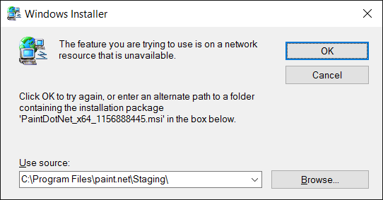
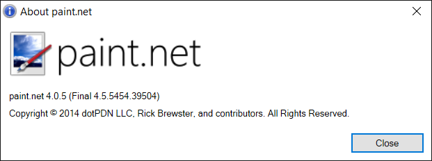
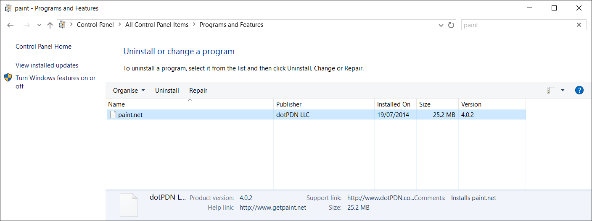
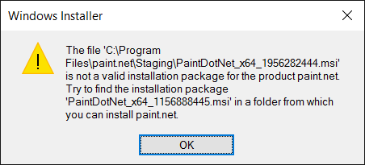

Recently, I launched [paint.net](http://getpaint.net) on my laptop and it wanted
to update. ‘Why not?’, I naturally thought. But, it had slipped my mind that I
had tried and failed to update paint.net on that laptop at some point not too
long ago.

My memory was rekindled when the installer for the new version complained (in a
roundabout way) about not being able to locate `PaintDotNet_x64_1156888445.msi`
in `C:\Program Files\paint.net\Staging`:

The situation was a bit more curious than that: paint.net reported itself as
version 4.0.5, while Programs and Features said paint.net 4.0.2 was installed.

The situation started to make more sense – I had at some point updated from
version 4.0.2 to 4.0.5, and then either used System Restore, or reverted to an
older Windows 10 build during the pre-RTM phase of the Windows Insider
programme. That, apparently, left it in this inconsistent state. (paint.net
4.0.5 was the current version from 7 December 2014 to 2 August 2015, so the
timeline fits.)

I didn't think it'd be too hard to rectify the problem – if it can't find the
installation source for the currently installed version, then either the 4.0.2
or the 4.0.5 paint.net installer should be able to sort it out. Alas, therein
lay the first problem: the official paint.net website only offers downloads for
the current version. I did not have the installers for 4.0.2 and 4.0.5 in my
downloads folder either, because I had used the auto-updater to update to them.
The download URL for 4.0.9 is
`http://www.dotpdn.com/files/paint.net.4.0.9.install.zip`. Changing the 4.0.9 in
that to an older version seemed worth trying. Alas, while it downloads a zip
file with the correct name, when you open it up it contains the installer for
version 4.0.8.

OK, so I’d have to get installers for 4.0.2 or 4.0.5 from elsewhere. Searching
Google for them was my first thought. And, indeed, a quick search brought up
some sites hosting old versions of paint.net. Generally, I'm a bit wary of such
sites, but in this case the installers were signed which was reassuring enough.
(My second thought was the Internet Archive's Wayback Machine. And indeed
putting a paint.net download URL such as
`http://www.dotpdn.com/files/paint.net.4.0.2.install.zip` into the Wayback
Machine's search box returns archived versions of the installer.)

I now had installers for both 4.0.2 and 4.0.5, so time to try running them. I
first tried running the 4.0.5 installer. It gave the same error about not being
able to locate `PaintDotNet_x64_1156888445.msi`. I then tried the 4.0.2
installer. Again, the same error. I had a look at what was now in
`C:\Program Files\paint.net\Staging`. Both installers had dumped MSI files
there, but neither of them matched the name of the MSI file the uninstaller
wanted. I then tried running the uninstaller again and manually pointing it at
each of those two MSI files. But, it rejected both of them:

If the MSI file it wanted wasn’t from either of those two versions, what the
hell was it?

A bit of observance at this point paid off. I noticed that each time I ran the
same paint.net installer, it dumped a new MSI file in the Staging directory.
They were all identical, but each of them had a different number at the end of
the file name. In other words, those numbers were being generated during
installation. I then suspected that one of MSI files for 4.0.2 and 4.0.5 was in
fact the correct one, but something was being picky about the file name and
wanted it to match `PaintDotNet_x64_1156888445.msi`. I tried renaming the 4.0.5
MSI to `PaintDotNet_x64_1156888445.msi` and pointing the uninstaller at it. It
rejected it. I then tried renaming the 4.0.2 MSI in the same way. And finally,
success! The damn thing uninstalled itself.

I then proceeded to install the latest version of paint.net. I'm not entirely
sure why I was in such a rush to do that.

I can only describe the whole situation as a moronic mess. A little more digging
revealed it was SetupFrontEnd.exe from the paint.net installer that was putting
the MSI file in the aforementioned Staging directory, and it was using a
[pseudo-random number generator](<https://msdn.microsoft.com/en-us/library/system.random.next(v=vs.110).aspx>)
to generate the number it was putting in the file name.
