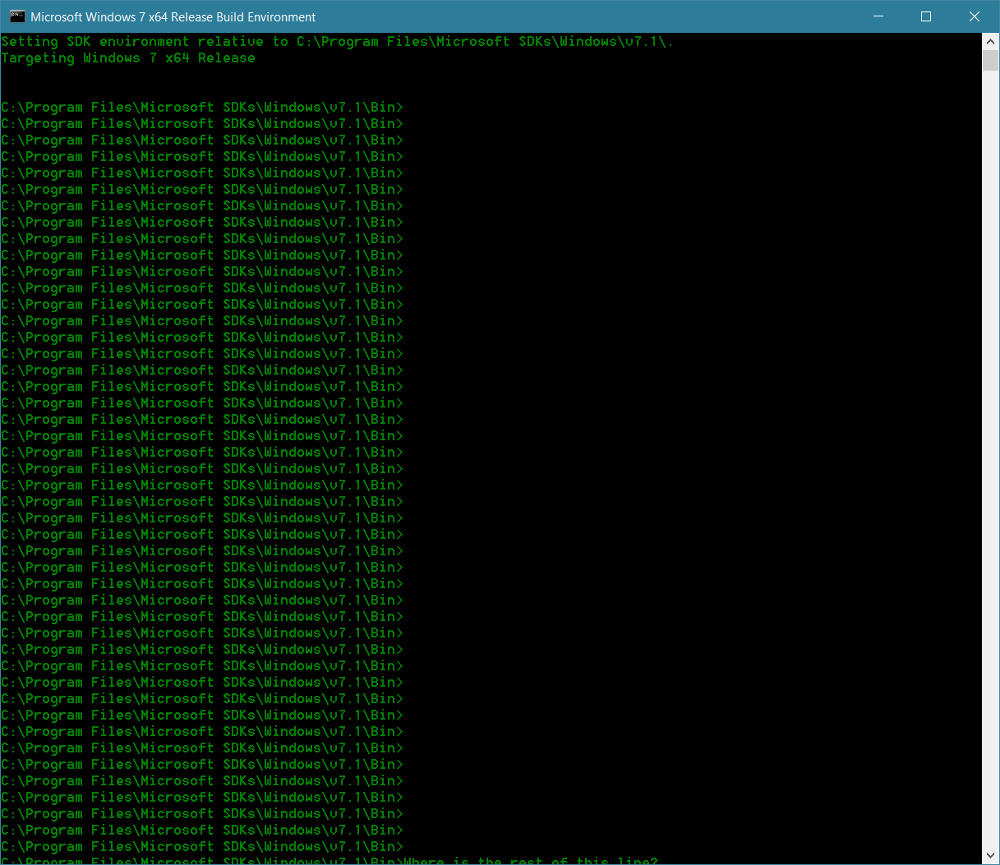

There are a few small bugs in Windows 10 that, despite being small bugs, manage
to irritate the hell out of me.

## 1. Desktop icon positions reset themselves during graphics card driver updates

This is a peculiar one, as it happens on my desktop, but not on another PC. The
bug is simple: while GeForce Experience is installing a new driver, the icons on
my desktop are automatically rearranged (as if 'Auto arrange icons' was turned
on and then off again). (I only mention GeForce experience, as that's how I get
my driver updates.) Now, I keep some frequently used shortcuts near the right
edge of the screen, so having them automatically moved from there and mixed in
with the other icons is annoying to say the least. And, nVidia release driver
updates fairly frequently so it is at least once a month it happens.

Since it doesn't happen on my laptop, I can only guess it's related either to
using 125% DPI or having an external display.

## 2. Bottom line of command prompts cut-off

When you reach the bottom of a command prompt, the active line ends up being
half cut-off.

You can scroll down, but it will just happen again when you next reach the
bottom of the window. My best guess again is that this is a high-DPI bug, since
it doesn't happen on my laptop (which is set to 100% DPI).

## 3. Pressing Ctrl on the lock screen doesn't always bring up the login screen

I like pressing Ctrl to wake up my monitor and bring up the login screen,
because it is usually a fairly innocuous key to press. The problem is that
sometimes pressing Ctrl on the lock screen brings up the login screen, while
other times it does nothing. I have no idea what the pattern is here (though I'm
pretty sure there is one).

## 4. It wakes up in the middle of the night to finish installing updates

My laptop is in my bedroom. If I hibernate it, Windows likes waking up in the
middle of the night to finish installing pending updates. So, I get woken up by
the sound of the laptop's DVD drive initialising and a glaring display. I have
no idea who thought this would be a good behaviour – Windows 10 giving <i>me</i>
sleep problems ranks among the worst problems it could give me. I don't even
think it installs the updates properly (or it wakes up early and does nothing
for a fair while). I haven't found a way to disable this behaviour, so I've
resorted to using shut down instead. My laptop is left connected to the mains,
if it matters (I hope it does, since it'd be even worse if it happens when
running on battery, or the laptop was in a laptop bag, say).

## 5. When installing new builds, it reinstalls different drivers

I have a laptop enrolled in the Windows Insider Programme. Whenever a new build
is installed, it installs a touch pad driver with a version lower than the one I
had previously installed myself. So, whenever a new build is installed, I have
to manually reinstall the correct touch pad driver version. Pretty annoying, as
some touch pad software/driver settings get reset in the process.

All of these problems are current, on fully up-to-date Windows 10 installation
as of today (28 March 2016).
