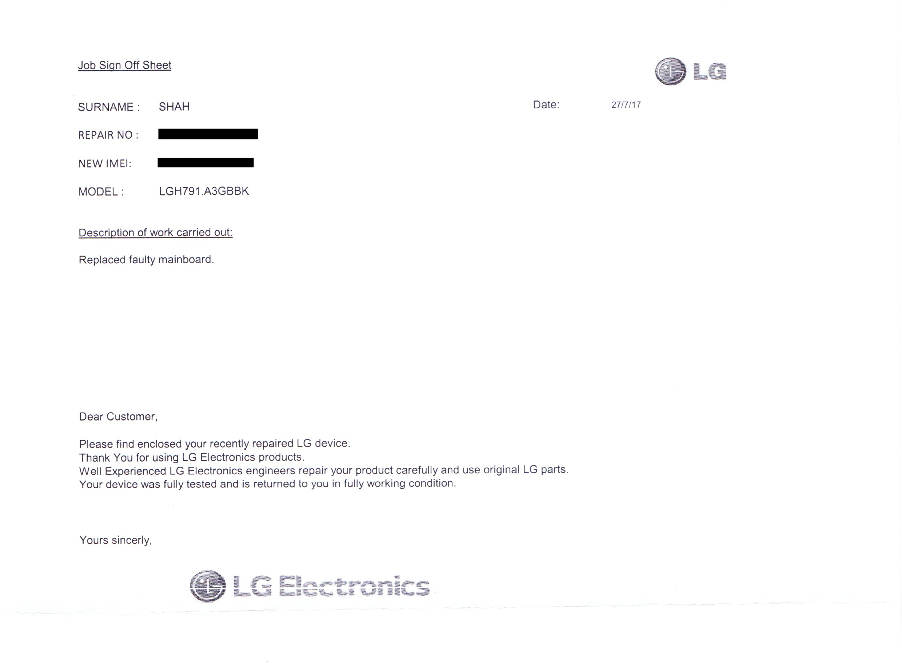

I bought a Nexus 5X in March last year and honestly it’s been the worst mobile
phone I’ve owned. Despite having fairly good specs, it was incredibly slow in
use and seemed to get slower with every major update.

Anyway, I was using Chrome last night when the device suddenly froze. I thought
it was the usual lag, but then the screen went black and then the Google logo
appeared. It appeared to be a reboot, and I was immediately reminded of the
well-known bootloop problems with the device and that I should probably make an
up-to-date backup the next day.

To my horror, the screen went black after showing the Google logo (instead of
proceeding to the boot animation). I tried turning the device on again, but the
same thing happened. Google logo, and then nothing.

I then entered the bootloader menu by holding down the volume-down key while
turning the device on. That worked. I selected the option to boot into recovery,
but that did not work. What was interesting is that this is not a bootloop, it’s
just a boot failure. I had a quick look online and found similar reports on
Reddit and the Google Nexus forums (some in the past few days, and some
explicitly mentioned using Chrome when it happened). I connected the device to a
charger but it was also showing the Google logo and then shutting down, so (not
wanting to make things worse) I unplugged it with the intention of seeing how it
is in the morning.

Unfortunately, in the morning, the device would not do anything. Apparently, the
battery had drained even though the device seemed to be off. Connecting it to a
charger yielded the flashing red LED, then the battery icon and then nothing. A
bit later and it wasn’t even doing that. I have no idea if it is charging now,
but I’m guessing not. I managed to get back into the bootloader menu once, but
that’s it. It’s now pretty much dead.

I bought the device from Argos and I thought I’d take it back to the shop to get
it sorted out quickly. I explained that it’s a known fault with the device, it
has a two-year warranty from LG and that my contract is with the retailer and
I’m protected for up to six years under the Consumer Rights Act. They refused to
help full stop, saying that they only offer a one-year warranty on the device
and the Consumer Rights Act doesn’t apply to mobile phones (and only to items
like kettles and toasters) and that I need to contact ‘Nexus’.

I called Argos customer services by phone later, who were more reasonable, but
said I need to get an independent engineer’s report. Which they can ask for
under law, but I can only imagine it being a complete faff for a mobile phone
and does not seem reasonable for a known fault and when there is still a
manufacturer’s warranty in effect.

I wanted the least hassle so I parked dealing with Argos and called LG next.
They were pretty clued-up, and are sending me instructions to return the item to
them for a repair using a locker-based service. However, it means I’ll be
without the phone for two weeks which is obviously inconvenient.

Anyway, the main lesson for me is **do not buy a mobile phone or anything of
value from Argos**. They sold me an item with a major manufacturing defect, and
essentially washed their hands of it. The fact is I’d have got better service
from Amazon (I only bought it from Argos because it was a good price at the
time).

**If you’re still using a Nexus 5X at this point I’d say you should expect it to
fail.** I thought I might've got lucky not having problems for over a year, but
I was wrong. Here are some links about Nexus 5X manufacturing defects:

- https://www.girardgibbs.com/lg-g4-bootloop-class-action-lawsuit/
- https://www.reddit.com/r/nexus5x/
- https://productforums.google.com/forum/#!forum/nexus
- https://en.wikipedia.org/wiki/LG\_smartphone\_bootloop\_issues

I’m now left with the task of sorting out access to online services I used which
were protected by two-factor authentication, and also working out if I’ve lost
anything important which was stored on the device. I’ve bought a temporary
device to tide my over until I’m ready to buy a proper replacement, and I
imagine I’ll just sell the repaired Nexus 5X once I get it back.

**Update 29 July 2017**

My Nexus 5X has been repaired and is back and my possession. I haven't done much
with it yet, but it's turning on and working normally so far.

According to LG, the mainboard was replaced:

The device has a new IMEI and was (unsurprisingly) wiped. It's definitely the
same device though (the screen protector that was on the device when I sent it
in was still in place, for example).
