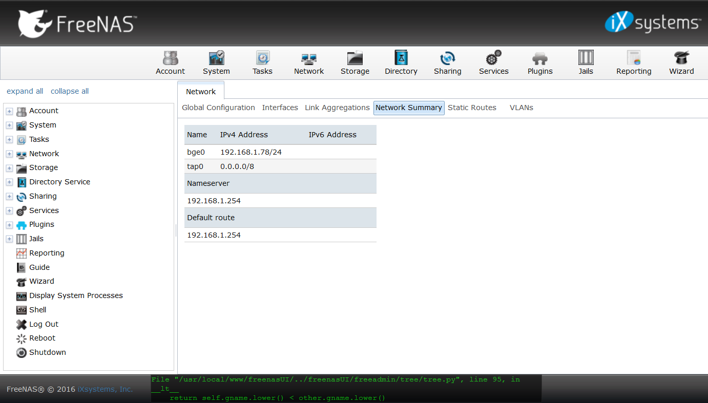
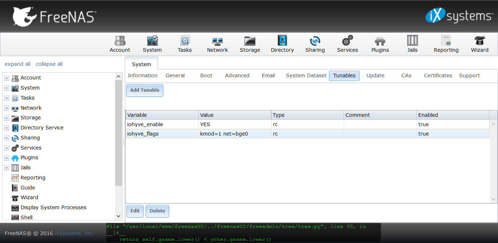

I have been running FreeNAS on an HP G7 N54L ProLiant MicroServer for a few
years, including running an Ubuntu Server VM in VirtualBox running in a FreeBSD
jail.

However, VirtualBox support in FreeNAS
[had been deprecated](https://forums.freenas.org/index.php?threads/freenas-10-x-bhyve-cpu-requirements.42059/#post-327659),
and as of FreeNAS 9.10.2
[it is broken and won't be fixed](https://bugs.freenas.org/issues/19696).

FreeNAS 9.10, however, includes support for an alternative in the form of bhyve.
In FreeNAS 9.10, it can only be managed using the command line, for which a tool
called iohyve is provided.

**Warning** FreeNAS 10 is due for release
[in late February](https://bugs.freenas.org/versions/272) and
[there currently isn't a migration path planned for iohyve VMs](https://bugs.freenas.org/issues/18185).
In fact, iohyve support on 9.10 is said to be experimental (although I would say
that is far from made clear in the documentation). It's not clear at this stage
what exactly will happen to the VMs on upgrade to FreeNAS 10 (once released),
but I would hope a similar process to this could be used to migrate VMs.

As I found my VM broken after updating to FreeNAS 9.10.2, I set about trying to
migrate the VM to bhyve using iohyve. Putting together various bits of
information I found online, I was able to successfully migrate the VM, and
here's how I did it.

Before attempting to migrate your own VMs, take note of the following points:

- Make sure your hardware has the virtualisation technology needed. See
  [this section of the FreeNAS documentation](http://doc.freenas.org/9.10/jails.html#using-iohyve)
  for how to check.
- Be aware that iohyve does not have the same feature set as VirtualBox (in
  particular no graphical console at present), and so may not be suitable for
  your purposes.
- This guide only applies to FreeNAS 9.10.x. I wouldn't expect it to work on
  other versions.

## Update FreeNAS if necessary

First of all, check the version of iohyve included with your FreeNAS build. You
can do this via SSHing to your FreeNAS box and running `iohyve version`:

```
[root@freenas] ~# iohyve version
iohyve v0.7.7 2016/11/10 I Think I'll Go for a Walk Edition
```

(The SSH user name and password is the same as what you use to access the web
interface.)

If iohyve is older than 0.7.7, update FreeNAS to the latest 9.10.x version.
FreeNAS 9.10.2 was the first version with iohyve 0.7.7.

## Set up iohyve

In order to set iohyve up, you need to know the name of your primary network
interface and the name of the ZFS storage pool you want to use. (Within that
pool, iohyve will create an `iohyve` dataset to use to store VM disks, ISOs and
firmware images.)

You can find out the name of your network interface using the FreeNAS web
interface on the **Network Summary** tab in the **Network** section:



In my case it was `bge0`. If you have multiple interfaces listed, look for the
one with the correct IP address. (You can also use `ifconfig` in your SSH
session if you prefer.)

If you don't know the name of your ZFS pool, you can also find that out from the
FreeNAS web interface, in the **Storage** section on the **Volumes** tab. The
top-level items are the ZFS pools (but referred to as volumes in the GUI). You
can use `zpool list` in your SSH session to obtain a list of pools and their
names if you prefer.

Armed with that information, we can now run the initial iohyve set-up command.
To do this, run:

```
iohyve setup pool=<pool name> kmod=1 net=<network interface name>
```

(substituting the network interface and pool names for the placeholders). For
example:

```
[root@freenas] ~# iohyve setup pool=ZFS kmod=1 net=bge0
Setting up iohyve pool...
On FreeNAS installation.
Checking for symbolic link to /iohyve from /mnt/iohyve...
Symbolic link to /iohyve from /mnt/iohyve successfully created.
Loading kernel modules...
bridge0 is already enabled on this machine...
Setting up correct sysctl value...
net.link.tap.up_on_open: 0 -> 1
```

**Note** As of FreeNAS 9.10.2,
[due to a bug you will get an error about the command not being able to find `setup_freenas`](https://bugs.freenas.org/issues/19757)
and as a result the command doesn't create a required symbolic link. The bug is
fixed in FreeNAS 9.10.2 U1, but if it happens to you, create the symbolic link
yourself:

```
[root@freenas] ~# ln -s /mnt/iohyve /iohyve
```

(You can see what the not-found function does
[in the iohyve source code](https://github.com/pr1ntf/iohyve/blob/4764917bf05b79fd6bd0e109229472451671535c/lib/ioh-setup#L79).)

## Convert the VirtualBox disk

Next, we need to convert the VirtualBox disk image to raw format. To do this, I
used the VBoxManage utility in the VirtualBox jail.

If your VM is still working within VirtualBox, make sure it is turned off. Then,
start a shell session within the jail:

```
[root@freenas] ~# jexec virtualbox csh
```

Run `VBoxManage clonehd <input disk> <output file> --format RAW`, for example:

```
root@virtualbox:/ # VBoxManage clonehd "/home/vbox/VirtualBox VMs/Ubuntu Server/Ubuntu Server.vdi" /tmp/ubuntu-server.raw --format RAW
0%...10%...20%...30%...40%...50%...60%...70%...80%...90%...100%
Clone hard disk created in format 'RAW'. UUID: 51f8dec9-aca5-4c62-b3aa-aa265ce1b6ad
```

**\*Note** If you are using a VirtualBox installation elsewhere to convert the
disk, the command has been changed to from `VBoxManage clonehd` to
`VBoxManage clonemedium disk` in newer versions.\*

Finally, exit the jail shell session:

```
root@virtualbox:/ # exit
exit
[root@freenas] ~#
```

## Create the iohyve VM and disk

Next we need to create the iohyve VM and disk. To do that, we need the path to
the raw disk image outside of the jail. We'll also need to make a note of the
image's exact file size. In my case the disk image was at
`/mnt/ZFS/jails/virtualbox/tmp/ubuntu-server.raw` and was 8589934592 bytes:

```
[root@freenas] ~# ll /mnt/ZFS/jails/virtualbox/tmp/ubuntu-server.raw
-rw-------  1 root  wheel  8589934592 Dec 27 12:59 /mnt/ZFS/jails/virtualbox/tmp/ubuntu-server.raw
```

To create the iohyve VM, run `iohyve create <vm name> <disk size>` (picking a
name for your VM, and using the size of disk image you just noted). For example:

```
[root@freenas] ~# iohyve create ubuntu-server 8589934592
Creating ubuntu-server...
```

## Configure the new VM

Configure the new VM using `iohyve set <vm name> <opt1>=<value1>…`. I used
`iohyve set ubuntu-server ram=1GB cpu=1 loader=grub-bhyve os=d8lvm`:

```
[root@freenas] ~# iohyve set ubuntu-server ram=1GB cpu=1 loader=grub-bhyve os=d8lvm
Setting ubuntu-server ram=1GB...
Setting ubuntu-server cpu=1...
Setting ubuntu-server loader=grub-bhyve...
Setting ubuntu-server os=d8lvm...
```

Refer to the [iohyve README](https://github.com/pr1ntf/iohyve) for more details
of the parameters. You'll also find examples for different OSes there (however,
the only place I found a full list of available OSes was in the
[iohyve source code](https://github.com/pr1ntf/iohyve/blob/ee3429b33190b8646f5b1b911206be6f3b623c92/lib/ioh-guest#L376)).

For Ubuntu, being Debian-based, the choices for `os` are `debian` and `d8lvm`.
This particular VM was using LVM partitions, so `d8lvm` was the right one for
me. If you aren't sure whether your VM is using LVM partitions, you can find out
from within the VM either using `fdisk -l` or
[checking `/etc/fstab`](http://askubuntu.com/questions/202613/how-do-i-check-whether-i-am-using-lvm).

You'll need to use `loader=grub-bhyve` if the guest OS you're using is using the
GRUB bootloader. (Don't attempt to install grub2-bhyve in FreeNAS itself as it's
already included and the FreeNAS OS isn't designed to be modified.)

## Copy the disk image to the new VM

The VM disk should be at `/dev/zvol/<pool name>/iohyve/<vm name>/disk0`. Use
your preferred utility to copy the RAW image to it. I used `dd`:

```
[root@freenas] ~# dd if=/mnt/ZFS/jails/virtualbox/tmp/ubuntu-server.raw of=/dev/zvol/ZFS/iohyve/ubuntu-server/disk0
16777216+0 records in
16777216+0 records out
8589934592 bytes transferred in 222.494671 secs (38607372 bytes/sec)
```

## Start the new VM

Run `iohyve start <vm name>` to start the VM. For example:

```
[root@freenas] ~# iohyve start ubuntu-server
Starting ubuntu-server... (Takes 15 seconds for FreeBSD guests)
[root@freenas] ~# GRUB Process does not run in background....
If your terminal appears to be hanging, check iohyve console ubuntu-server in second terminal to complete GRUB process...
```

You may get some other output like this:

```
rdmsr to register 0xc0010048 on vcpu 0
rdmsr to register 0xc001102a on vcpu 0
Unhandled ps2 mouse command 0xe1
Unhandled ps2 mouse command 0x0a
Unhandled ps2 mouse command 0x01
Unhandled ps2 mouse command 0x41
Unhandled ps2 mouse command 0x88
vm exit[0]
        reason          SVM
        rip             0xffffffffc0172efa
        inst_length     2
        exitcode        0x7b
        exitinfo1       0x504021c
        exitinfo2       0xffffffffc0172efc
```

It is likely to be harmless (depending on the content).

Now, you can connect to the VM's console using `iohyve console <vm name>`, for
example (you may prefer or need to do this in another shell session):

```
[root@freenas] ~# iohyve console ubuntu-server
Starting console on ubuntu...
~~. to escape console [uses cu(1) for console]
Connected
```

At this point, I could press a key and see the Ubuntu login prompt. (Since the
VM had successfully started up, I was also able to SSH to it.) If you see GRUB
or similar in the console it is something may have gone wrong at some point
(e.g. wrong OS type configured).

Despite the output above claiming `~~.` quits the console, for me it was `~.`
(and `~?` for help). (See the
[cu(1) documentation](<https://www.freebsd.org/cgi/man.cgi?cu(1)>) for more
information on console commands.)

## Set iohyve and the VM to start on boot

To keep iohyve working after a reboot, you need to set some tunables in the
FreeNAS web interface. In the System section, on the Tunables tab, add two
rc.conf entries for `iohyve_enable`=`YES` and
`iohyve_flags`=`kmod=1 net=<network interface name>` (using the network
interface name from earlier). Afterwards, the page should look similar to this:



**Update 17 January 2017** After upgrading to FreeNAS 9.10.2 U1, I found my
tunable entries had been lost and so I had to recreate them.

To set the VM to start on boot, run `iohyve set <vm name> boot=1`. For example:

```
[root@freenas] ~# iohyve set ubuntu-server boot=1
Setting ubuntu-server boot=1...
```

## Shares and tidying up

VirtualBox had functionality (which I had been using) to share directories
between the host and guest VM. I couldn't find equivalent functionality in
iohyve, so I used network shares instead. I added the CIFS share for the
directory to `/etc/fstab` in the VM using one of the available guides (don't ask
me why there are two):

- https://wiki.ubuntu.com/MountWindowsSharesPermanently
- https://help.ubuntu.com/community/MountWindowsSharesPermanently

(You can, of course, use whatever network sharing protocol suits you and is
supported by FreeNAS. CIFS was just easiest for me.)

You may need to remove any previously installed VirtualBox additions in the VM.
If installed, there should be an uninstall script at
`/opt/VBoxGuestAdditions-X.X.X/uninstall.sh` (where `X.X.X` is the version of
the VirtualBox additions installed). For more information, see
[the VirtualBox manual](https://www.virtualbox.org/manual/ch04.html#idm1995).

Once you're happy with how the new VM is working, you can delete the old
VirtualBox jail (and the raw disk image we created earlier) if you no longer
have a use for them.

## That's it

My VM was up and running again at this point. So far I've been happy with it
(certainly happier than I was with VirtualBox on FreeNAS).

## Further reading and acknowledgements

I found the following resources useful when converting my VM and documenting the
steps I took above. You may find them useful if you have further questions.

- http://doc.freenas.org/9.10/jails.html#using-iohyve
- http://justinholcomb.me/blog/2016/03/26/migration-to-freebsd-part4.html
- https://www.youtube.com/watch?v=rCDh9K16Q5Q
- https://github.com/pr1ntf/iohyve
