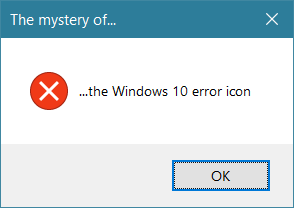
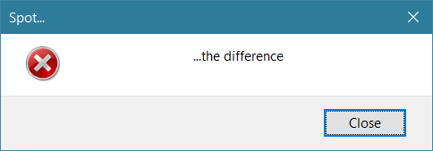
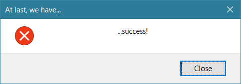

I noticed that, in Columns UI, the Windows 10 standard error icon as displayed
by
[MessageBox](<https://msdn.microsoft.com/en-gb/library/windows/desktop/ms645505(v=vs.85).aspx>)
looks like this:

However, the error icon in my custom dialogue box looked like a bit of a relic
in comparison:

I was left scratching my head. I was getting the icon by calling
[LoadImage](<https://msdn.microsoft.com/en-gb/library/windows/desktop/ms648045(v=vs.85).aspx>)
and asking for the standard error icon (OIC_ERROR, also known as OIC_HAND,
IDI_ERROR and IDI_HAND). Why would that return a different icon, and where does
the mysterious version that MessageBox uses come from?

And, unsurprisingly, this problem wasn't just limited to the error icon. Here's
a comparison of the various new and old MessageBox icons:

I looked at the resources in various Windows DLLs to try and find a clue to
where the newer versions of the icons come from, thinking that perhaps they were
different icons with different identifiers. However, I could only find various
copies of the older Windows 7-era icons.

I then noticed that MessageBox only uses the newer icon when
[using a manifest specifying that Common Controls version 6 should be used](<https://msdn.microsoft.com/en-gb/library/windows/desktop/bb773175(v=vs.85).aspx>).
That suggested that the answer lay within the Common Controls, so I had a quick
look on MSDN at what general Common Control functions existed. I soon found the
[LoadIconMetric](<https://msdn.microsoft.com/en-gb/library/windows/desktop/bb775701(v=vs.85).aspx>)
and
[LoadIconWithScaleDown](<https://msdn.microsoft.com/en-gb/library/windows/desktop/bb775703(v=vs.85).aspx>)
functions. Both of these return the newer icons when using version 6 of the
Common Controls:

And that solves our mystery.[^1]

(Note, though, that these functions require the caller to destroy the returned
icon when it's no longer needed, unlike LoadImage when used with the LR_SHARED
flag.)

[^1]:
    Although, I'm still not quite sure where these new icons live in the file
    system.
