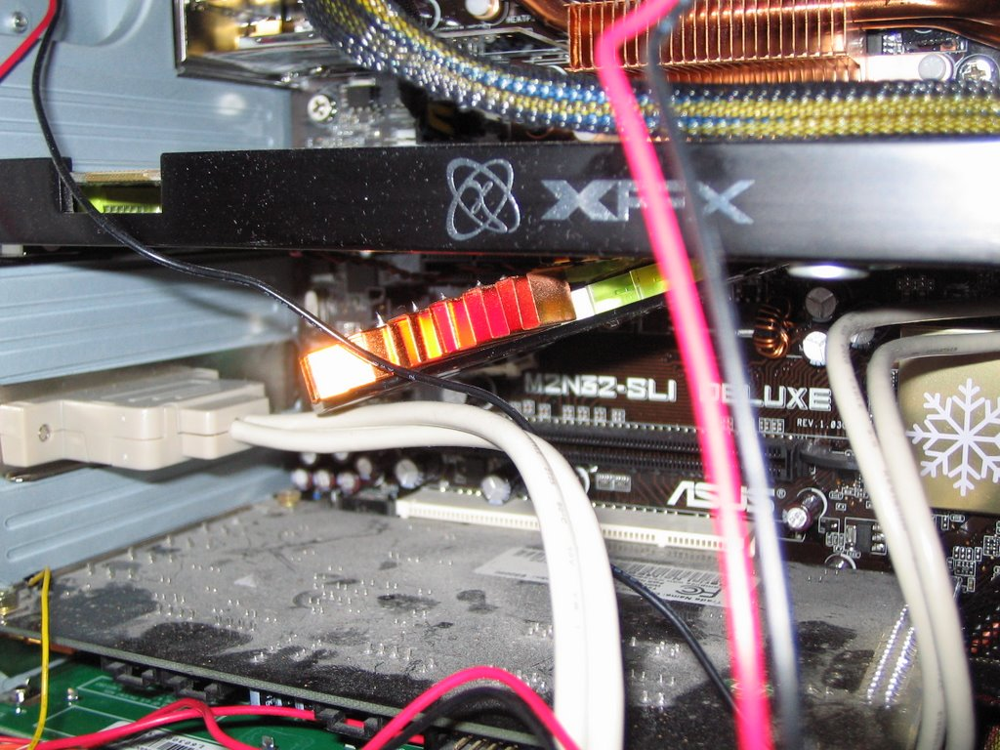
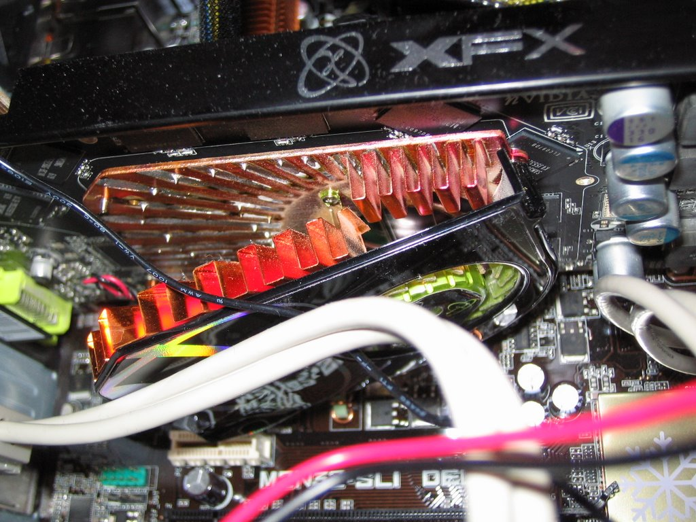
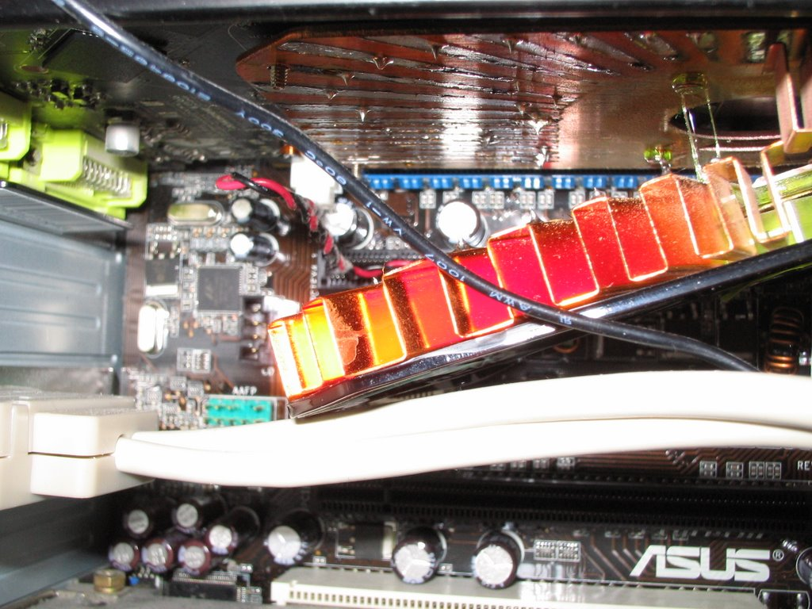
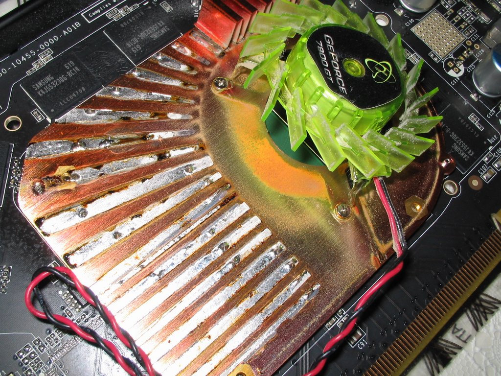

So, you happily set up Vista RC1 to install and leave your computer alone whilst
it does so. But when you come back, the monitor is off... strange. Computer
doesn't seem to be doing anything, so you give it several minutes but nothing
happened and you are left with no choice but to restart the thing. Lo and
behold, monitor is on again, everything seems OK. You boot from Vista DVD just
in case it happened again, but everything is OK so you restart. Sh\*t! Monitor
turns goes into standby again and then Vista starts booting. It takes ages -
seems to still be installing, so turning computer off doesn't seem really like
the smartest of ideas. After \~20 mins, computer reboots... hmm it reboots
again... in fact it's rebooting continuously and not even POST-ing!

Yes, that is exactly what happened to me! My first thought was to try and clear
the CMOS memory. So, I popped of the side of my computer to be greated by a
sight: the heatsink had fallen off my beautiful 7900GT! I could not believe what
had happened and I still don't now!

Apparently, the card massively overheated (probably the fan failed). We are
talking of temperatures of possibly 200C in order for the solder to melt. So
much for the card's overheat auto shut-down capability then! Very very luckily
the heatsink hit the cable lying underneath it - otherwise it could have done a
lot of damage!

Here are several photos for your amusement: 

 Melted plastic is always a good sign (Hint - look in the
top-right of the photo). Not to mention the drips of solder!

 Mmmm... toasty!
