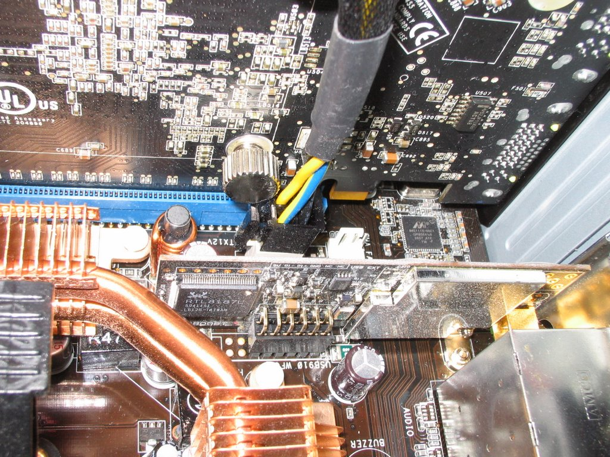

Asus M2N32-SLI Deluxe + XFX 7900GT + Zalman VF900-Cu = No Go

So, after my supposedly high end 7900GT fell to pieces, I thought it may be
worthwhile investing in a Zalman VF900-Cu cooler for my warranty replacement
7900GT when it arrives (in the hope it would protect me against the fan failing
again). So I check Zalman's website - great, its compatible with my 7900GT, so
of I go to order the thing...

A few days later, everything arrives, so I put the card and the VF900 together.
It was fairly straightforward and didn't pose any real problems. But then came
installing the card into my PC - and I hit a big snag. It turns out the cooler
is compatible with my card, but not quite my Asus M2N32-SLI Deluxe motherboard
it seems! Behold the photo I took below:

As you can roughly see, the 4-pin 12V connector on the motherboard is now
obstructing the screw/bolt on the back of the card, and the card will not slot
in! Yes, great design on Asus's part by putting the 12V connector in such a
stupid place.

In the end I had to sacrifice my Audigy sound card in the top PCI slot and put
the 7900GT in the bottom PCI-E x16 slot. It is also now pretty much touching the
PCI card in the bottom slot and causing bad heat build up there. Of course I
don't have much choice - the stock fan is loud enough to be heard upstairs!

In summary, if you have the Asus M2N32-SLI Deluxe motherboard, and a 7900GT,
don't even think about putting the VF900 on it! Hell, it's even a good enough
reason to avoid the M2N32-SLI Deluxe board for me!
