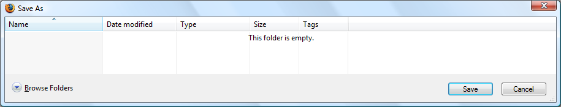
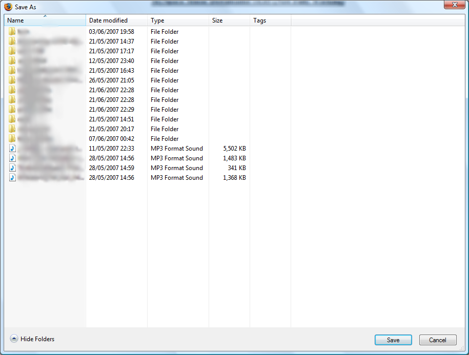
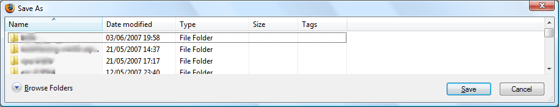

I click "Save As" one day in my favourite application only to be very confused:
 Ahem, where do I enter the filename?? Which folder is
empty?! Let's try clicking the "Browse Folders" button:
 OK, now my folder is not empty but still nowhere
to change folder or enter the filename.

One last try, let's click the "Hide Folders" button:
Now, this was in Mozilla Firefox. So who's to
blame, Firefox or Vista? It is a standard dialog provided by Windows so it would
be odd for Firefox to cause this. However it was not occurring in other
applications at the time and trying again to save a file in Firefox resulted in
the same mess. Even the breadcrumb/navigation bar was missing! Maybe OLE/COM
initialisation related, who knows...
