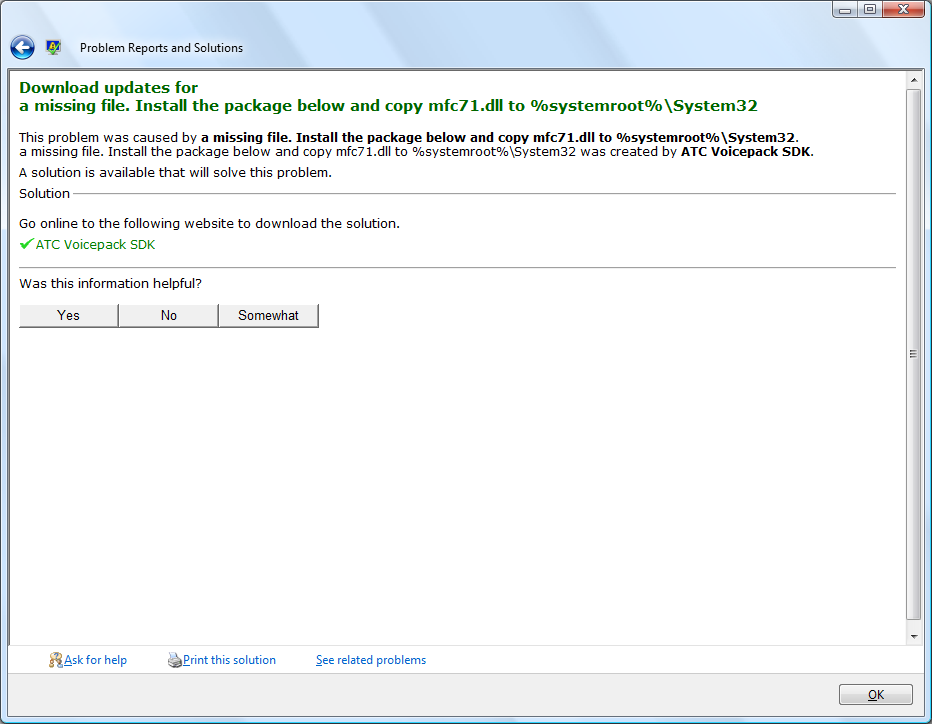

How many things are wrong in the screenshot below? In case
you're wondering,
[this](http://download.microsoft.com/download/c/a/0/ca0f7542-1e1d-4ea0-96d0-57981d1f314a/fs2004_sdk_atc_voicepack_setup.exe)
is the rather random file linked.

Maybe this solution came from Microsoft's "COMMUNITY SOLUTIONS CONTENT" which
also produces some pretty bad knowledge base articles - just how do you
[lunch Internet Explorer](http://support.microsoft.com/default.aspx/kb/556052)?
