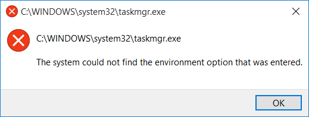

I came across an interesting problem recently. I was editing some environment
variables on a Windows 10 PC, using some third-party software. After doing that,
a few things started behaving oddly, such as some system programs would not
open. Things got worse after rebooting: I could not right-click on the start
button, I could not open Task Manager, I couldn't start anything that required
elevation and Windows Firewall kept telling me it was turned off.

Most of the actions that failed to do anything would hang for a fair while,
eventually displaying dialog boxes with the message 'The system could not find
the environment option that was entered'. Like this:

As it turned out, the cause of all these problems was that WINDIR environment
variable had been deleted. _(Of course, not intentionally.)_ And it really was
was catch-22: I could not edit the system environment variables without
elevation. The best I managed to do was kill explorer.exe using Process
Explorer, start a command prompt, set %WINDIR% in the command prompt and start
explorer.exe. Alas, that only helped marginally, and trying to open the advanced
system properties (SystemPropertiesAdvanced.exe, as it turns out) in the same
way did not work.

All was not lost: I could still access the modern settings app and reboot into
the recovery menu. From there, I was able to use System Restore to go back a day
to when WINDIR was still present. (Of course, I'm sure there are other ways I
could've fixed it, but I just took the easiest and quickest solution at the
time.)

After all that, I was curious about whether the standard Windows environment
variables editor lets you delete the WINDIR environment variable. I just tried
(in a VM of course): yes, it does.
