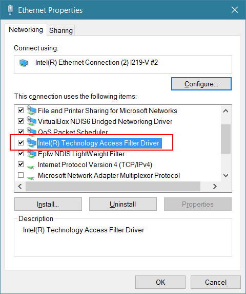

I just installed the latest version of the Intel Management Engine software from
my motherboard manufacturer's website (version 11.6.0.1032).

During installation, I got multiple alerts from my software firewall that it was
connecting to the internet, which seemed unusual. I looked closer and it was
something (rather fittingly) called Intel Online Connect. In fact, both an Intel
Online Connect and an Intel Online Connect Access had been installed (in
`%programfiles%\Intel`).

It wasn't immediately clear what they were, so I searched for 'Intel Online
Connect' online and found various copies of a
[press release](http://www.businesswire.com/news/home/20161024005454/en/Visa-Intel-Collaborate-Drive-Payment-Security-Connected)
\[[archive](http://archive.is/nigR6)], which indicated Intel Online Connect was
something to do with online payments. Here's an excerpt:

> By providing hardware-level data—in the form of a secure device code—during
> the 3-D Secure authentication process, issuers can have even greater
> confidence to approve low-risk transactions, or to require additional
> verification for suspicious ones. Called Intel® Online Connect, the solution
> will be included in 7th Gen Intel® Core™ systems and will work with the
> existing 3-D Secure protocol and the upcoming 2.0 version, which EMVCo is
> expected to release this year.

I carried on looking and I noticed that Intel Online Connect Access included a
driver – more specifically an
[NDIS filter driver](https://msdn.microsoft.com/en-gb/windows/hardware/drivers/network/introduction-to-ndis-filter-drivers)
\[[archive](http://archive.is/YoSo5)].

Here it is: 

(The Epfw one is my ESET Smart Security, so I'm not alarmed to see that one
there.)

Looking at the INF file and the registry, it has a FilterType of 2, which makes
it
[a modifying filter](https://msdn.microsoft.com/en-gb/windows/hardware/drivers/network/types-of-filter-drivers)
\[[archive](http://archive.is/Xmdoo)]:

```ini
[Inst_Ndi]
HKR, Ndi,Service,,"ndisrd"
HKR, Ndi,CoServices,0x00010000,"ndisrd"
HKR, Ndi,HelpText,,%ndisrfl_HelpText%
HKR, Ndi,FilterClass,, compression
HKR, Ndi,FilterType,0x00010001,0x00000002
HKR, Ndi\Interfaces,UpperRange,,"noupper"
HKR, Ndi\Interfaces,LowerRange,,"nolower"
HKR, Ndi\Interfaces, FilterMediaTypes,,"ethernet,wan,tunnel,ppip"
HKR, Ndi,FilterRunType, 0x00010001, 1 ;this filter must run before any protocol can bind to the below miniport
```

Whilst I don't know what this driver is actually doing, I do know it's not going
to be doing it much longer on this PC.
