I had repeatedly encountered useless links in Microsoft programs, and I knew
Windows 10 was no exception to this. Here I was in the Display Colour
Calibration applet, wondering what it exactly it does, when I saw a 'How do I
calibrate my display?' link:

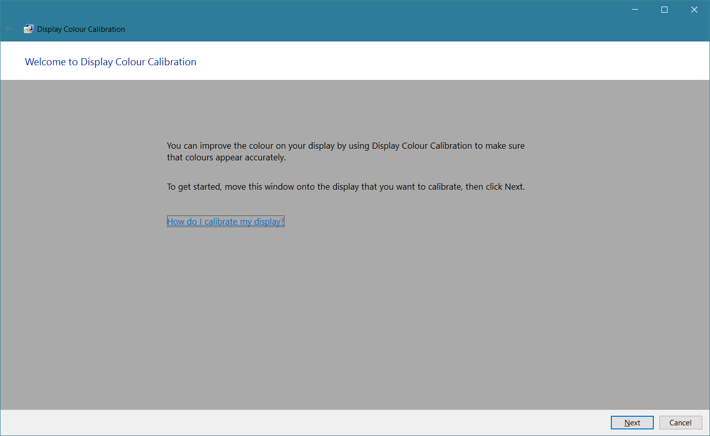

I thought the link would answer my question, but upon clicking it, I was shown
the main support page for Windows 10 (containing no specific information about
display calibration):

Confused, I thought I'd try searching for the question in the link I had just
clicked. However, that only brought up irrelevant content:

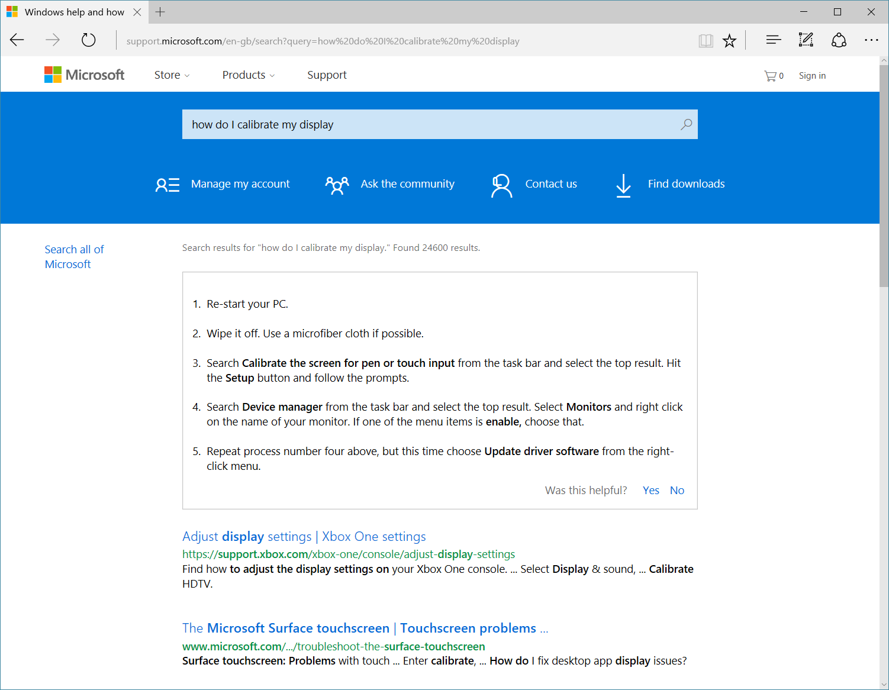

Having just encountered one useless link, I thought I'd have a nose around for
more. 'How does indexing affect searches?' was the next link I found:

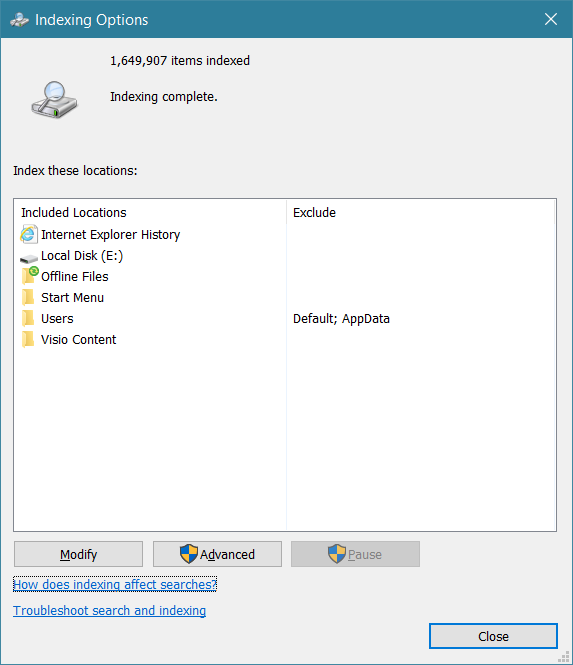

Wondering where it would take me, I clicked it, and was greeted by the general
Windows 10 support page once again:

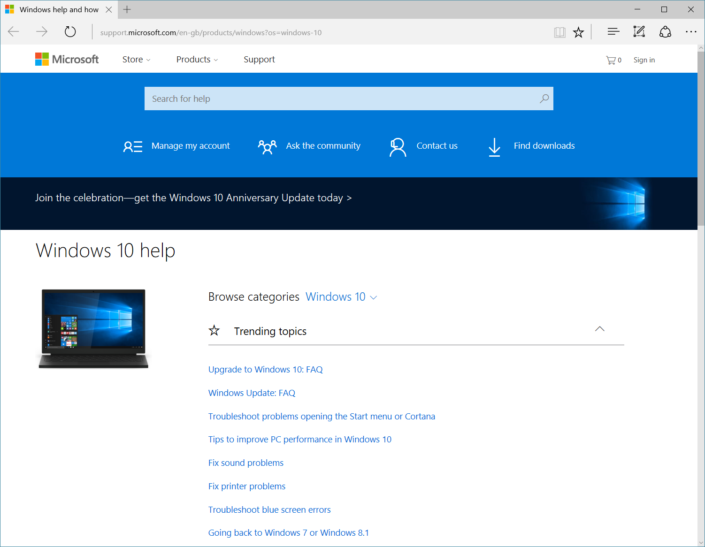

What about this link to 'Learn more about Pop-up Blocker'?

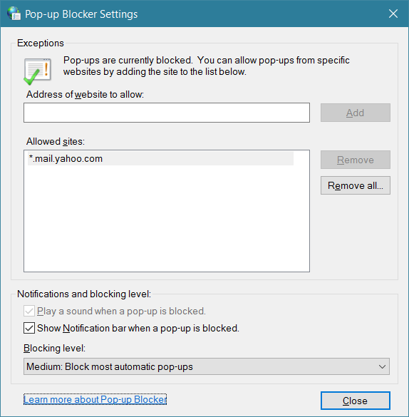

That one brings up content about SmartScreen Filter instead:

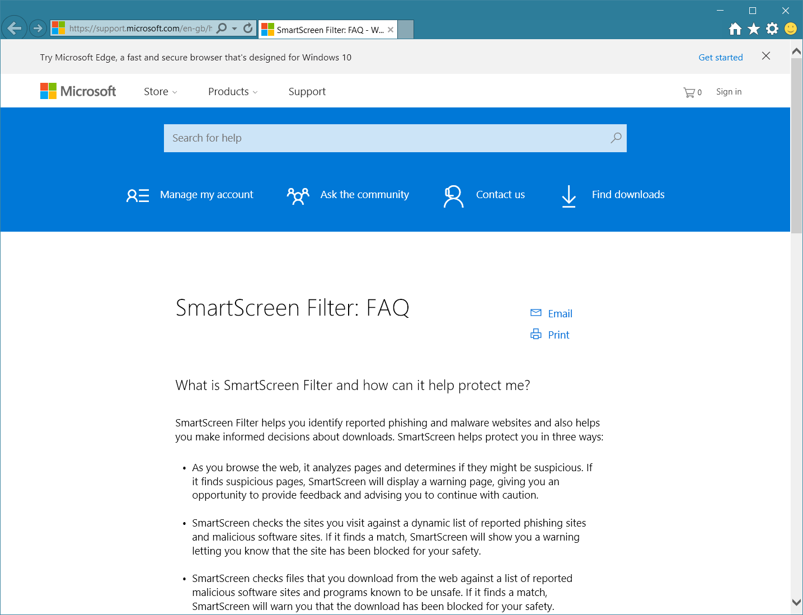

How about 'Tell me more about power plans'?

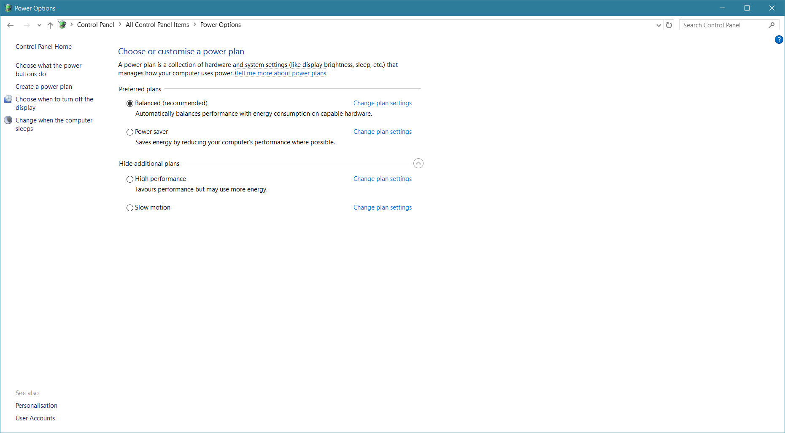

That one takes us back to the now familiar Windows 10 support page:

Here's another link – 'How do I know what security settings are right for my
computer?'

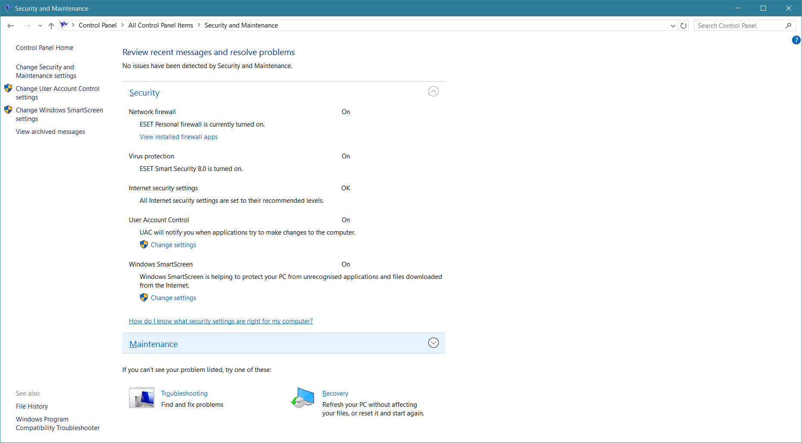

And, perhaps unsuprisingly, it brings up the main Windows 10 support page again
(though this time it wants me to 'share \[my] experience'):

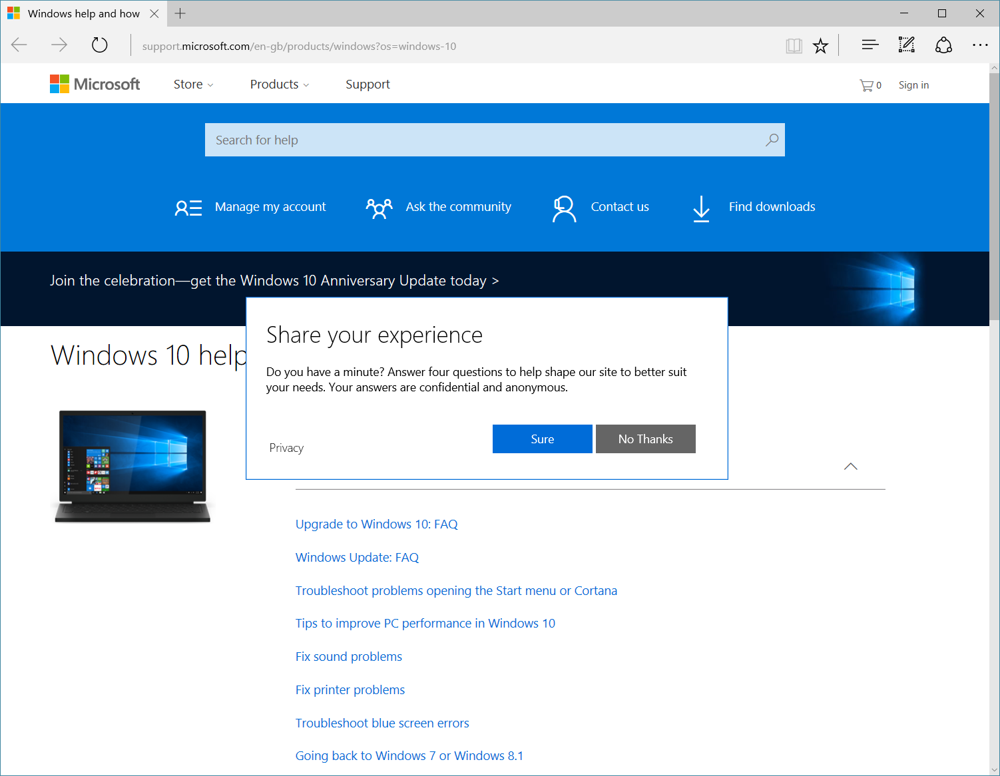

What about the Windows SmartScreen privacy statement?

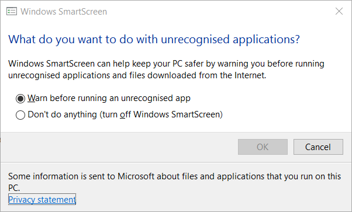

Apparently, there isn't one:

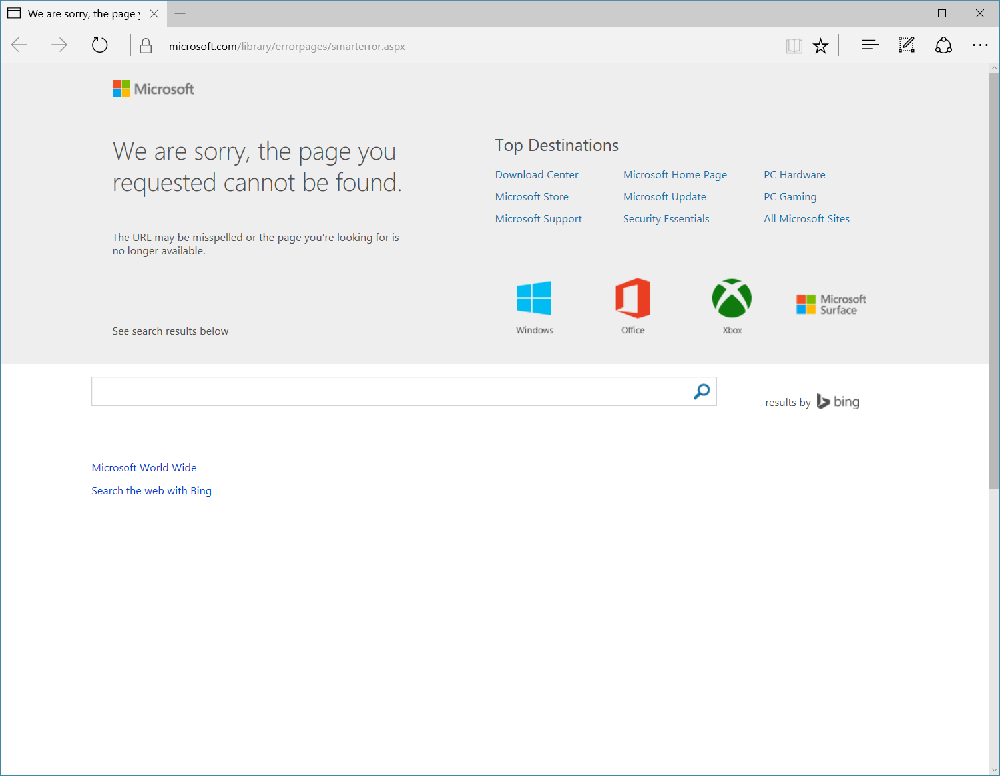

And, lastly, how about this link to 'tell me more about User Account Control
settings'?

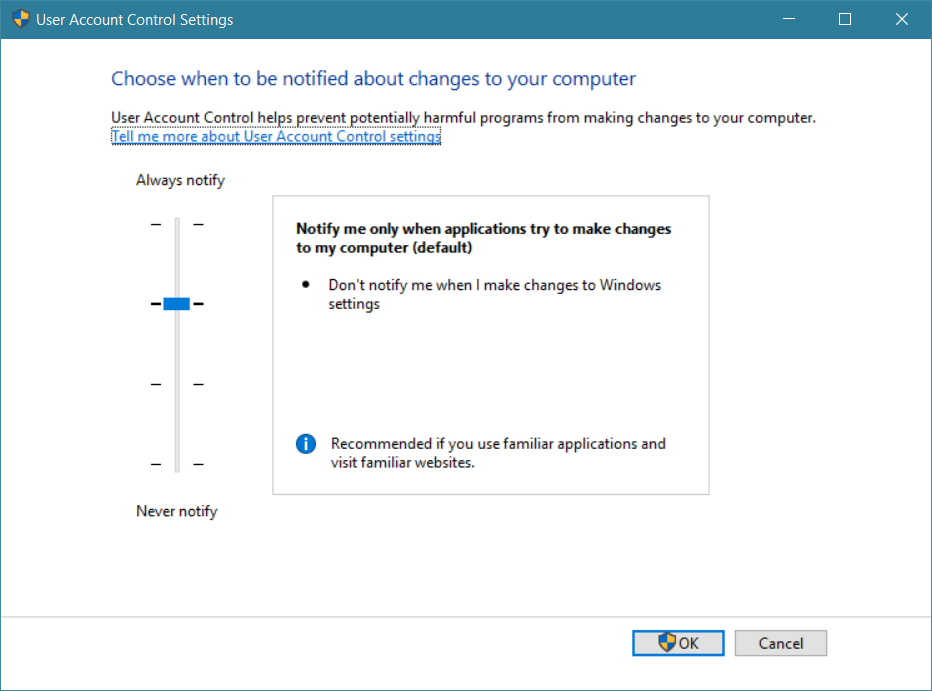[^1]

You guessed it – clicking it brings up the general Windows 10 support page:

That is just a selection of the useless links I found – there were plenty more.
I don't think it's unreasonable to expect such links to go to specific content
related to the link text itself. Instead, you often get a generic help page,
where searching for the expected content yields nothing particularly relevant in
most cases. A poor show in my view, and all of these were found simply through a
few minutes of inquisitive clicking around.

[^1]:
    The window in this screenshot looks blurry because of some incompatibility
    with Windows 10's standard DPI-scaling mode.
