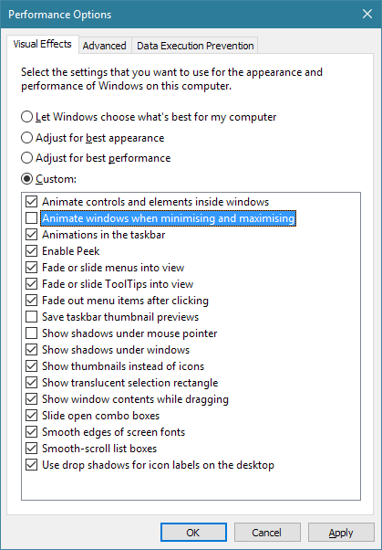

This one has been an ongoing problem for at least several months. I have been
able to reproduce it on every Windows 10 PC I encountered, and there are
references to the problem all over the internet. And yet the problem still
exists on a fully up-to-date installation of Windows 10.

The problem is simple. In Performance options[^1], there is a setting called
‘Animate windows when minimising and maximising’:

If it is turned off, you get this for a lock screen:

As evident, the lock screen is a mocking blackness which still has the image
captions for the Windows Spotlight image that it is meant to be displaying.
Further mocking ensues when proceeding to the logon screen, as the background
image appears while the captions and ‘Like what you see?’ links disappear.
Rating the images becomes such a palaver, you don’t bother.

The
[official response from Microsoft in the Feedback Hub](https://aka.ms/Ngf8tv)[^2]
is that the problem was resolved ‘in builds 14390 and later’. However, I am
running the current release build which is 14393.576 and the problem persists.
There are tens of other reports in the Feedback Hub,
[and across the internet](https://www.google.co.uk/search?q=windows+10+black+lock+screen),
so there would appear to be little else left that one can do to try and get the
problem fixed.[^3]

[^1]:
    The easiest way to access this is to type ‘performance’ in the taskbar
    search box, and select ‘Adjust the appearance and performance of Windows’
    from the results.

[^2]:
    Viewing the feedback item, unfortunately, requires the Windows 10 Feedback
    Hub app and a Microsoft Account.

[^3]:
    Perhaps it is fixed in the latest Insider build, but I have not checked, and
    I am not prepared to run a pre-release version of Windows just to fix it.
