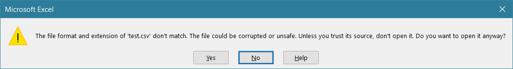
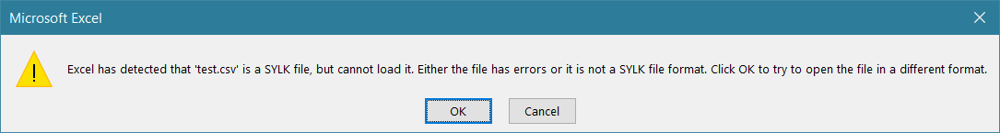
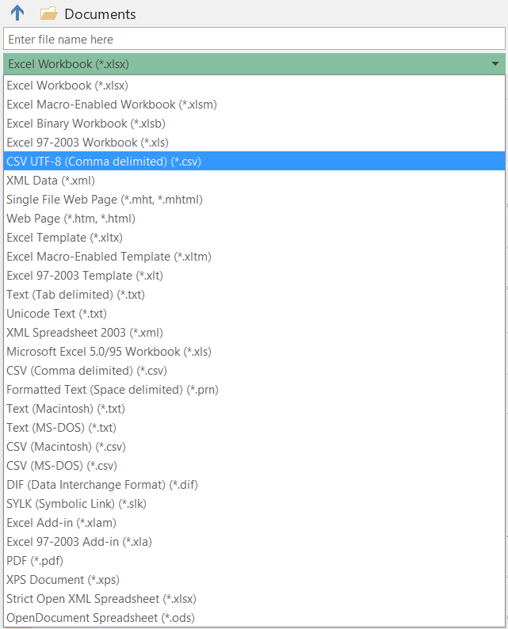

## The unintelligible error messages

I recently tried to open a CSV file in Excel and was greeted with this
mysterious error:

Clicking ‘Yes’ yielded another error:

And, despite what the message says, after clicking OK I was greeted with a blank
spreadsheet.[^1] I could recall encountering this error message in the past, but
what the exact cause was had slipped my mind.

A quick Google search yielded the answer – because the CSV file started with
`ID` (i.e. that was the first value in the first row),
[Excel decided that it was a SYLK file](<https://en.wikipedia.org/wiki/SYmbolic_LinK_(SYLK)>).

My intention was to generate CSV files programmatically, and it needed to be
possible to open them in Excel. There are some workarounds online, such as
putting ID in quotes. However, it then becomes very easy to resave the file and
then have Excel refuse to open it. In fact, if you create a new spreadsheet in
Excel with ID in the first cell, and save it as a CSV file, _it will refuse to
open it the next time you try_.

A simple solution is to add another word before ID (to specify what type of ID
it is e.g. ‘Blog post ID’).

## A Unicode entanglement

My next problem with my file was that it was UTF-8-encoded, but Excel seemed to
have assumed it was ANSI-encoded as characters such as é did not display
correctly. (Excel does have an import function that lets you select the correct
file encoding, however that’s not too helpful when the files are going to be
opened on a regular basis, by many different people.)

‘Ah, a UTF-8 BOM will sort that out’, I thought. And, indeed, it did make Excel
open the file correctly. However, if you resave it using the Save command, it
replaces commas with tabs and saves the file as ANSI. (In other words, the file
is pretty much destroyed.)

Now, Excel does have a CSV UTF-8 option when using Save as:

That in itself does behave correctly. However, even if you use that, the
commas-to-tabs-and-UTF-8-to-ANSI problem happens if you reopen the file and use
the Save command.[^3]

## The end

Of course, these problems can be avoided by using another file format.
Nonetheless, it should be possible to address those problems in Excel for the
most part. (A relevant fact is that Notepad has managed to open BOM-less
UTF-8-encoded files for years.[^2])

[^1]:
    Oddly enough, trying to open the file again after clicking OK does open the
    file, and without any errors.

[^3]: Which I decided to just accept.

[^2]:
    It does a pretty good job,
    [though as you as you’d expect it’s not infallible](https://blogs.msdn.microsoft.com/oldnewthing/20070417-00/).
